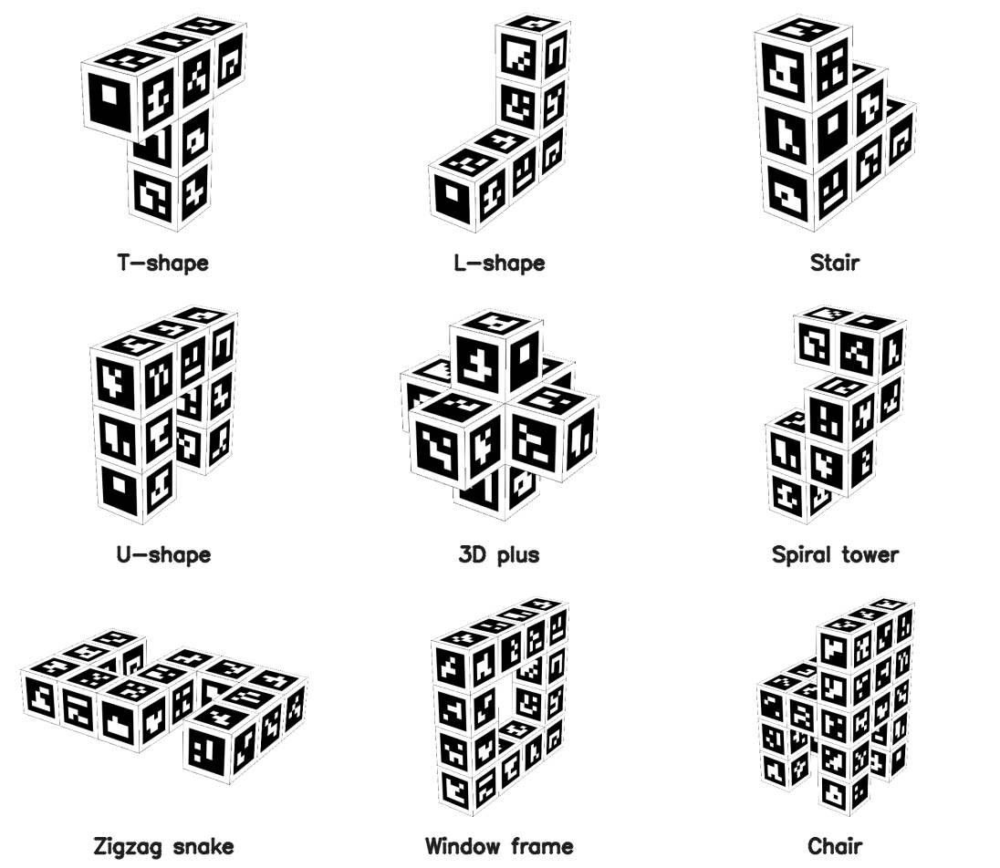

# aprilcube


Generate 3D-printable fiducial targets with ArUco or AprilTag markers, then detect their 6-DOF pose from a camera. Targets can be simple cubes/cuboids or richer voxel-composed shapes such as T-shapes, chairs, frames, and stair-step objects.

## Overview

**aprilcube** is a two-part pipeline:

1. **Generator** — Creates a multi-color 3MF file with markers on the target surface, ready for dual-color 3D printing (Bambu Studio / AMS)
2. **Detector** — Detects the target in a camera image and estimates its full 6-DOF pose (rotation + translation)

Cuboid targets are parameterized by grid layout, tag dictionary, tag size, margins, and borders. Voxel targets are specified as unions of axis-aligned voxel cuboids; the generator places one marker on each exposed voxel face and writes exact 3D corner coordinates into `config.json`. Both modules share the same config, so the detector knows the precise 3D position of every tag corner even when the target is not a box.



## Technical Report

Read the technical report: [AprilCube: 3D-Printable Fiducial Targets for Reliable 6-DoF Pose Estimation](docs/paper.pdf).

If you use AprilCube in research, please cite:

```bibtex
@software{park2026aprilcube,
  title={AprilCube: 3D-Printable Fiducial Targets for Reliable 6-DoF Pose Estimation},
  author={Park, Younghyo and Agrawal, Pulkit},
  year={2026},
  url={https://github.com/younghyopark/aprilcube},
}
```

[](https://www.star-history.com/?repos=younghyopark%2Faprilcube&type=date&legend=top-left)


## Update Log

### v0.2.0

This release expands AprilCube from cuboid-only fiducial blocks into a broader target-design toolkit:

#### New Features

- Added YAML generation specs for `cuboid`, `voxel_cuboids`, and `voxel_grid` targets, including CLI overrides via `aprilcube generate target.yaml`.
- Added expressive voxel targets with one marker per exposed voxel face and explicit per-marker `corners_mm`, `face_corners_mm`, voxel, face, and normal metadata in `config.json`.
- Updated detection to consume explicit marker geometry, so non-cuboid targets can use the same multi-marker PnP and filtering pipeline as classic cubes.
- Added a standalone browser voxel designer through `aprilcube web`, with a Three.js shape editor, textured preview, dictionary sizing checks, YAML export, and printable-output command guidance.
- Added ready-to-print example target specs and generated assets for T, L, stair-step, U, plus, spiral tower, zigzag snake, window-frame, and chair shapes.
- Added per-target README files, thumbnails, textured OBJ assets, and MuJoCo MJCF exports.

#### Bug Fixes

- Fixed 3MF compatibility with the latest Bambu Studio app by writing Bambu Studio 2.x project metadata.

## Installation

```bash
pip install aprilcube
```

Requires Python 3.10+ and installs `opencv-contrib-python`, `numpy`, and `pyyaml`.

## Python API

```python
import aprilcube

# Create a detector from config.json and camera intrinsics
det = aprilcube.detector("my_target/config.json", {"fx": 800, "fy": 800, "cx": 320, "cy": 240})

# Process a frame (BGR numpy array)
result = det.process_frame(frame)

if result["success"]:
    rvec = result["rvec"]       # Rodrigues rotation vector (3x1)
    tvec = result["tvec"]       # Translation vector in mm (3x1)
    error = result["reproj_error"]  # Reprojection error in pixels
    faces = result["visible_faces"] # Set of visible face names
```

### `aprilcube.detector(cube_cfg, intrinsic_cfg, **kwargs)`

Creates a `CubePoseEstimator` ready to process frames. The class name is kept for API compatibility, but configs may describe either cuboid or voxel-composed targets.

| Arg | Type | Description |
|-----|------|-------------|
| `cube_cfg` | `str \| Path` | Path to `config.json` or generated model directory |
| `intrinsic_cfg` | `str \| Path \| dict \| np.ndarray` | Camera intrinsics (see below) |
| `extrinsic` | `np.ndarray \| None` | 4x4 world-to-camera transform (default: `None`) |
| `enable_filter` | `bool` | Enable Kalman temporal smoothing (default: `True`) |
| `filter_config` | `KalmanFilterConfig \| None` | Custom filter tuning |
| `dist_coeffs` | `np.ndarray \| None` | Override distortion coefficients |
| `fast` | `bool` | Faster detection for real-time use (default: `False`) |

**`intrinsic_cfg` formats:**

```python
# Path to calibration JSON (keys: "camera_matrix", optional "dist_coeffs")
det = aprilcube.detector("config.json", "calib.json")

# Dict with fx, fy, cx, cy
det = aprilcube.detector("config.json", {"fx": 800, "fy": 800, "cx": 320, "cy": 240})

# 3x3 numpy camera matrix directly
K = np.array([[800, 0, 320], [0, 800, 240], [0, 0, 1]], dtype=np.float64)
det = aprilcube.detector("config.json", K)
```

### 3D Visualization (viser)

The detector has built-in web-based 3D visualization via [viser](https://github.com/nerfstudio-project/viser). Call `build_viser()` to start a server — it automatically renders the latest `process_frame` result in a background thread.

```bash
pip install viser trimesh
```

```python
import cv2
import aprilcube

det = aprilcube.detector(
    "models/my_target",  # directory or config.json path
    {"fx": 800, "fy": 800, "cx": 320, "cy": 240},
    fast=True,
)

# Start viser server (auto-renders in background)
server = det.build_viser(port=8080)

# Your capture loop — viser updates automatically
cap = cv2.VideoCapture(0)
while True:
    ret, frame = cap.read()
    if not ret:
        break
    det.process_frame(frame)
```

The scene includes world/camera/object coordinate frames, a ground grid, and the textured target mesh (loaded from `mujoco/cube.obj` in the model directory). The returned `ViserServer` can be customized — add objects to `server.scene` before or after starting the loop.

### World-frame poses

Pass `extrinsic` (a 4x4 T_world_cam matrix) to get object poses in world frame:

```python
import numpy as np

det = aprilcube.detector("my_target", intrinsics, extrinsic=np.eye(4))
result = det.process_frame(frame)
T_world_obj = det.world_pose(result)  # 4x4 numpy array or None
```

### Async (background detection)

Run detection in a background thread so `get_latest()` never blocks your main loop:

```python
import cv2
import aprilcube

det = aprilcube.detector("models/my_target", intrinsics, fast=True)
det.start_async()

cap = cv2.VideoCapture(0)
while True:
    ret, frame = cap.read()
    det.submit_frame(frame)       # non-blocking, replaces any pending frame
    result = det.get_latest()     # returns last completed result instantly
    if result and result["success"]:
        print(result["T"])         # 4x4 camera-frame pose matrix

det.stop_async()
```

`submit_frame` uses a swap-not-queue design — if detection is slower than capture, intermediate frames are automatically skipped so the detector always works on the freshest frame.

### Direct class access

```python
from aprilcube import CubePoseEstimator, CubeConfig, KalmanFilterConfig
from aprilcube.generate import TagPatternGenerator, CubeMeshBuilder, ThreeMFWriter
```

## CLI

### Generate Targets

```bash
aprilcube generate [options]
```

The CLI can generate classic cuboids from flags or arbitrary voxel-composed targets from YAML specs:

```bash
# Simple cube, one tag per face
aprilcube generate --grid 1x1x1 --dict 4x4_50 --tag-size 30

# 2x2 cube with AprilTags
aprilcube generate --grid 2x2x2 --dict apriltag_36h11 --tag-size 20

# Flat calibration box
aprilcube generate --grid 5x4x1 --dict 4x4_100 --tag-size 15 -o flat_box

# Large cube with fine cell control
aprilcube generate --grid 3x3x3 --dict 6x6_250 --cell-size 2.5 --margin-cell 2 --border-cell 2

# YAML cuboid spec
aprilcube generate examples/cuboid_target.yaml

# Voxel-cuboid T-shaped target
aprilcube generate examples/t_shape_target.yaml

# Higher-ID-count voxel target
aprilcube generate examples/chair_target.yaml
```

### YAML generation specs

`aprilcube generate` can also read a YAML file. Supported shapes are `cuboid`, `voxel_cuboids`, and `voxel_grid`. Voxel targets place one marker on each exposed voxel face and write explicit marker corner coordinates into `config.json`.

```yaml
output: models/my_yaml_cube
shape:
  type: cuboid
  grid: [2, 2, 1]
dictionary: 4x4_50
markers:
  ids: 0-15
size:
  tag_size_mm: 24
layout:
  margin_cells: 1
  border_cells: 1
material:
  extruder: 1
  invert: false
```

A T-shaped target can be expressed as a union of axis-aligned voxel cuboids:

```yaml
output: models/t_shape_target
shape:
  type: voxel_cuboids
  voxel_size_mm: 24
  cuboids:
    - name: stem
      origin: [1, 0, 0]
      size: [1, 1, 3]
    - name: crossbar
      origin: [0, 0, 2]
      size: [3, 1, 1]
dictionary: 4x4_50
markers:
  ids: 0-63
size:
  tag_size_mm: 18
layout:
  margin_cells: 1
  border_cells: 1
```

The repository includes several ready-to-generate voxel examples:

| Spec | Model directory | Dictionary | Markers | Shape idea |
|------|-----------------|------------|---------|------------|
| `examples/t_shape_target.yaml` | `models/t_shape_target` | `4x4_50` | 22 | T-shaped target |
| `examples/l_shape_target.yaml` | `models/l_shape_target` | `4x4_50` | 22 | L/corner target |
| `examples/stair_step_target.yaml` | `models/stair_step_target` | `4x4_50` | 24 | stepped target |
| `examples/u_shape_target.yaml` | `models/u_shape_target` | `4x4_50` | 30 | U-shaped target |
| `examples/plus_shape_target.yaml` | `models/plus_shape_target` | `4x4_50` | 30 | 3D plus target |
| `examples/spiral_tower_target.yaml` | `models/spiral_tower_target` | `4x4_50` | 34 | rising spiral tower |
| `examples/zigzag_snake_target.yaml` | `models/zigzag_snake_target` | `4x4_50` | 46 | flat serpentine target |
| `examples/window_frame_target.yaml` | `models/window_frame_target` | `4x4_50` | 48 | frame with open center |
| `examples/chair_target.yaml` | `models/chair_target` | `4x4_100` | 78 | chair with four legs and backrest |

### Options

| Arg | Default | Description |
|-----|---------|-------------|
| `spec` / `-c, --config` | — | YAML generation spec |
| `-g, --grid` | `1x1x1` | Tags per dimension: `WxHxD` |
| `-d, --dict` | `4x4_50` | ArUco/AprilTag dictionary |
| `-t, --ids` | auto | Tag IDs: range (`0-23`) or comma-separated |
| `--tag-size` | `30` | Tag size in mm |
| `--cell-size` | — | Cell size in mm (alternative to `--tag-size`) |
| `--margin-cell` | `1` | Gap between adjacent tags, in cells |
| `--border-cell` | `1` | Outer border per face edge, in cells |
| `-o, --output` | `aruco_cube` | Output directory |
| `--extruder` | `1` | Bambu Studio extruder number |
| `--invert` | — | Swap black/white |

## Cuboid Grid Format (`--grid WxHxD`)

For cuboid targets, the grid specifies how many tags along each axis (X, Y, Z):

| Grid | Shape | Faces |
|------|-------|-------|
| `1x1x1` | Cube | 1 tag per face, 6 total |
| `2x2x2` | Cube | 4 tags per face, 24 total |
| `5x4x1` | Flat box | 20 tags top/bottom, narrow side strips |
| `1x1x3` | Tall pillar | 3 tags on tall sides, 1 on caps |

A 2D shorthand `RxC` is also supported for backward compatibility (e.g., `2x3` expands to a cuboid).

For voxel targets, `grid` is inferred from the occupied voxel extent and each exposed voxel face gets one marker. The generated `config.json` contains a `markers` list with `id`, `face`, `voxel`, `normal`, `corners_mm`, and `face_corners_mm` for every marker.

## Supported Dictionaries

**ArUco:** `4x4_50`, `4x4_100`, `4x4_250`, `4x4_1000`, `5x5_*`, `6x6_*`, `7x7_*`, `aruco_original`

**AprilTag:** `apriltag_16h5`, `apriltag_25h9`, `apriltag_36h10`, `apriltag_36h11`

## Output

The output directory contains:

```
my_target/
  cube.3mf              # Multi-color 3MF for Bambu Studio (paint_color attribute)
  config.json           # All parameters needed by the detector
  thumbnail.png         # 6-view preview with dimensions, tag IDs, and axis indicators
  mujoco/
    cube.xml            # MuJoCo MJCF model (references cube.obj + cube_atlas.png)
    cube.obj            # Wavefront OBJ mesh with UV coordinates
    cube.mtl            # Material file referencing the atlas texture
    cube_atlas.png      # Texture atlas for MuJoCo/OBJ visualization
```

**`config.json`** example:

```json
{
  "dict": "4x4_100",
  "grid": "2x2x2",
  "tag_ids": [0, 1, 2, "..."],
  "faces": {
    "+X": [0, 1, 2, 3],
    "-X": [4, 5, 6, 7],
    "+Y": [8, 9, 10, 11],
    "-Y": [12, 13, 14, 15],
    "+Z": [16, 17, 18, 19],
    "-Z": [20, 21, 22, 23]
  },
  "tag_size_mm": 24.0,
  "cell_size_mm": 4.0,
  "box_dims": [60.0, 60.0, 60.0]
}
```

Voxel-target configs additionally include explicit marker geometry:

```json
{
  "target": {
    "type": "voxel_cuboids",
    "voxel_size_mm": 24.0,
    "occupied_voxels": 5
  },
  "markers": [
    {
      "id": 0,
      "face": "-X",
      "voxel": [0, 0, 2],
      "normal": [-1.0, 0.0, 0.0],
      "corners_mm": [[-36.0, 9.0, 33.0], "..."]
    }
  ]
}
```

**`mujoco/cube.xml`** can be loaded directly in MuJoCo for simulation:

```bash
python -m mujoco.viewer --mjcf my_target/mujoco/cube.xml
```

The OBJ mesh + atlas texture are standard formats and can also be opened in Blender, MeshLab, etc. The coordinate frame matches the detector's 6-DOF pose output (origin at target bounding-box center, units in meters).

## How the Detector Works

The detection pipeline runs per-frame and combines several techniques for robust, accurate 6-DOF pose estimation from 3D-printed fiducial targets.

### 1. ArUco Detection (tuned for 3D-printed surfaces)

The OpenCV ArUco detector is configured with parameters optimized for markers printed on FDM surfaces:

- **Sub-pixel corner refinement** (`CORNER_REFINE_SUBPIX`, win=5, 50 iterations, 0.01px accuracy) — critical for PnP accuracy since corner localization error directly propagates into pose error
- **Wide adaptive thresholding** (window 3–53px, step 4) — handles the uneven surface texture and slight color bleeding typical of multi-material FDM prints
- **Relaxed candidate filtering** (min perimeter 1%, max 400%, polygon approx 5%) — allows detection at oblique viewing angles where markers appear as thin parallelograms
- **High-resolution bit sampling** (8 pixels/cell, 13% ignored margin) — improves bit decoding under perspective distortion from steep viewing angles

### 2. Multi-Marker PnP

Unlike single-marker pose estimation (which suffers from the planar degeneracy problem), all detected tag corners across all visible faces are aggregated into a single PnP solve:

- **>=6 points**: `solvePnPRansac` with the SQPNP solver, 200 iterations, 3px reprojection threshold, 99% confidence. SQPNP is a non-iterative solver that handles the general (non-planar) case efficiently.
- **4-5 points**: Direct `solvePnP` with SQPNP (not enough points for RANSAC).
- **Levenberg-Marquardt refinement** (`solvePnPRefineLM`) on the RANSAC inlier set for sub-pixel pose accuracy.

Having tags on multiple faces of a known 3D geometry eliminates the planar ambiguity and provides 3D point spread, which dramatically improves pose stability compared to single-face detection. For voxel targets, the PnP map comes directly from the explicit `markers[*].corners_mm` records rather than from cuboid grid assumptions.

### 3. Error-State Kalman Filter

For video/streaming mode, an error-state extended Kalman filter provides temporal smoothing and prediction:

**Translation state** — standard linear KF with constant-velocity model:
- State: `[x, y, z, vx, vy, vz]` (position + velocity in mm and mm/s)
- Process noise: white-noise jerk model (`sigma_accel = 2000 mm/s²`)

**Rotation state** — multiplicative error-state formulation on unit quaternions:
- Nominal state: unit quaternion `q` (maintained separately, updated multiplicatively)
- Error state: `[dθx, dθy, dθz, ωx, ωy, ωz]` (small-angle rotation error + angular velocity)
- Process noise: `sigma_alpha = 30 rad/s²`
- After each correction step, the error rotation is folded back into the nominal quaternion and reset to zero

This avoids the singularities and normalization issues of filtering quaternions or Euler angles directly.

**Adaptive measurement noise** — the measurement covariance `R` is scaled per-frame based on:
- Reprojection error (higher error → less trust)
- Number of detected tags (fewer tags → less trust)
- Inlier ratio from RANSAC (lower ratio → less trust)

**Mahalanobis gating** — innovation outlier rejection:
- Soft gate (χ² > 16): inflate measurement noise 10× (down-weight but don't discard)
- Hard gate (χ² > 100) or 3+ consecutive outliers: full state re-initialization

**KF prediction** serves dual purpose:
- Provides initial guess to PnP solver for faster convergence and disambiguation
- Acts as fallback when detection fails (brief occlusion, motion blur), bridging gaps using the velocity model

### Pipeline Summary

```
Frame → Grayscale → ArUco detect → Filter to target IDs → Identify visible faces
  → Aggregate 2D-3D correspondences → PnP (with KF prediction as initial guess)
  → LM refinement → Kalman update → Filtered 6-DOF pose
```

## How Target Size Is Calculated

For cuboids, all dimensions are quantized to `cell_size`:

```
cell_size = tag_size / marker_pixels
axis_cells = 2 * border + N * marker_pixels + (N-1) * margin
axis_mm = axis_cells * cell_size
```

For `--grid 2x2x2 --dict 4x4_100 --tag-size 24 --margin-cell 1 --border-cell 1`:
- `cell_size = 24 / 6 = 4 mm`
- `axis_cells = 2*1 + 2*6 + 1*1 = 15`
- `box = 15 * 4 = 60 mm` per axis → 60 x 60 x 60 mm cube

For voxel targets:

```
face_cells = voxel_size / cell_size
box_dims = occupied_voxel_extent * voxel_size
```

Each exposed voxel face receives one centered marker. For `voxel_size_mm: 24` and `tag_size_mm: 18` with a 4x4 dictionary, `marker_pixels = 6`, so `cell_size = 3 mm` and each voxel face is an 8x8 cell grid: 1-cell border, 6-cell marker, 1-cell border.

## Face Coordinate System

Cuboid tags are assigned to faces in this order: +X, -X, +Y, -Y, +Z, -Z. Each face has a defined "right" and "down" direction (viewed from outside) such that `cross(right, down) = outward normal`, ensuring correct triangle winding.

Voxel target markers use the same face coordinate convention, but each marker is tied to a specific exposed voxel face in the `markers` list.

## Printing

Designed for dual-color FDM printing on Bambu Lab printers with AMS (Automatic Material System).

### Supported Printers

Any Bambu Lab printer with AMS or AMS Lite:

- **Bambu X1 / X1C** — AMS (4 slots)
- **Bambu P1S / P1P** — AMS Lite (4 slots)
- **Bambu A1 / A1 mini** — AMS Lite (4 slots)

### Setup

1. Open `cube.3mf` in Bambu Studio
2. Use filament colors: extruder 1 = black, extruder 2 = white (PLA recommended)
3. Slice and print — the 3MF uses `paint_color` attributes for automatic color assignment

## License

MIT
