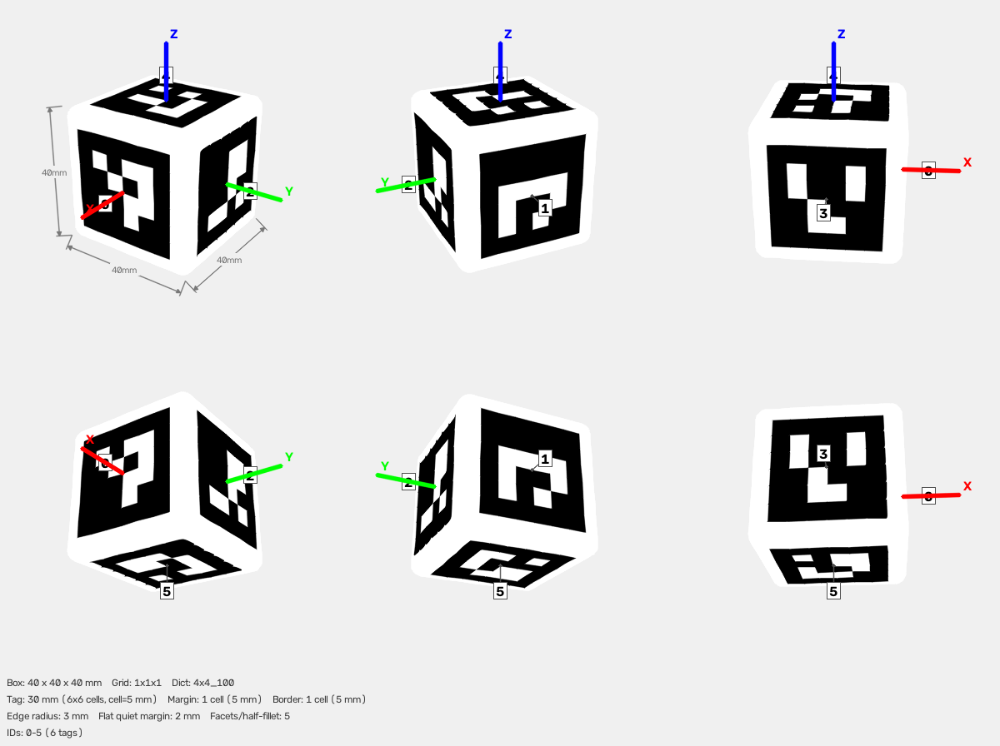
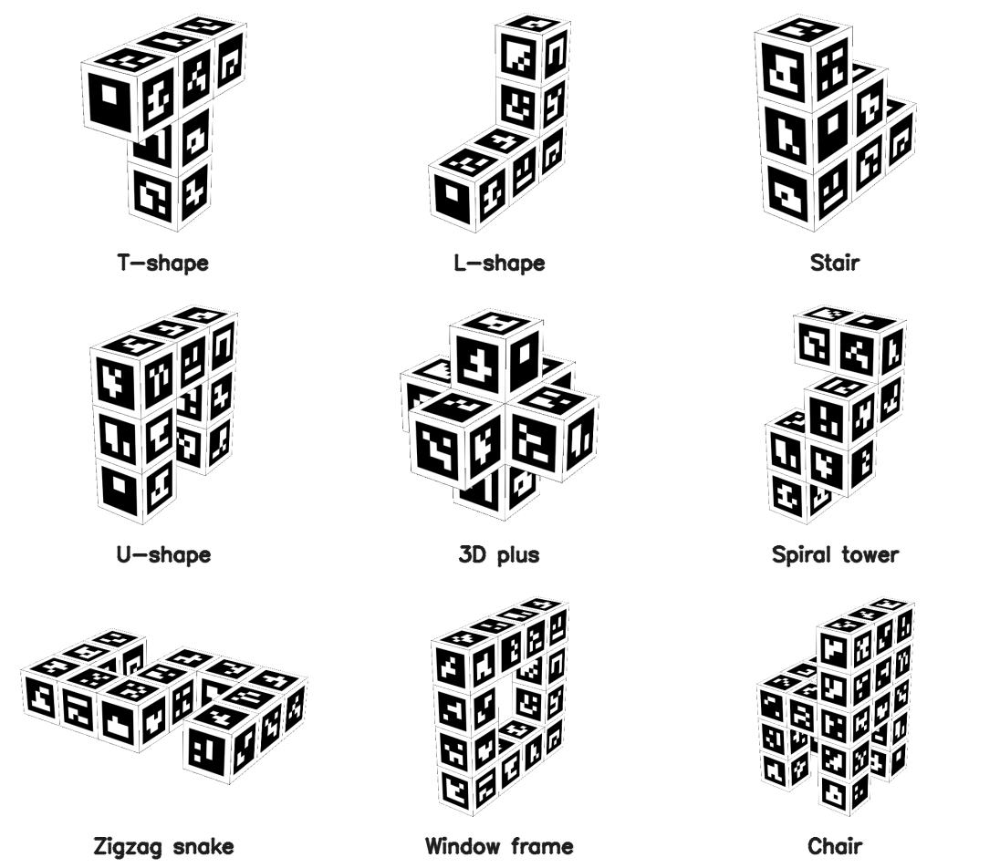

# AprilCube — G1 target geometry fork

A fork of [AprilCube](https://github.com/younghyopark/aprilcube) with rounded
target geometry developed for Dex3 manipulation. AprilCube generates printable
fiducial targets and estimates their 6-DoF pose from camera images.

[](https://sri299792458.github.io/g1-research-docs/perception/targets.html)

*Rendered 40 mm target with rounded edges and flat marker faces. Use the
configuration generated for the chosen print; this target is distinct from
the 60 mm stacking-demo cubes.*

**[Printed targets and mounts](https://sri299792458.github.io/g1-research-docs/perception/targets.html)** ·
[Full G1 guide](https://sri299792458.github.io/g1-research-docs/) ·
[Documentation source](https://github.com/sri299792458/g1-research-docs)

## Additions for the G1 work

This fork adds rounded edges and corners while retaining planar marker faces.
The geometry options apply to both cuboids and voxel-composed targets. See the
[40 mm target geometry and print notes](docs/dex3_safe_cube_design.md), its
[generation specification](examples/dex3_safe_cube.yaml), and the generated
[print files and detector configuration](models/dex3_safe_cube/).

The stateless detector exposes current-frame marker correspondences and pose
hypotheses, including both positive-depth planar IPPE branches. The G1 tabletop
application applies its own resting-pose and multi-frame consistency checks.
See [the pose-hypothesis API](docs/usage.md#stateless-pose-hypotheses).

The target generator and detector belong here; robot-specific wrist/torso
fixtures and calibration tools live in
[robot-calibration-aprilcube-prototype](https://github.com/sri299792458/robot-calibration-aprilcube-prototype).

## Installation

For this fork's additions, use Python 3.10 or newer and install from its source:

```bash
git clone https://github.com/sri299792458/aprilcube.git
cd aprilcube
python -m pip install -e .
```

The G1 application repositories pin their own AprilCube submodule revisions;
initialize those recorded revisions when reproducing an experiment. A plain
`pip install aprilcube` installs the upstream package rather than selecting this
fork. Dependencies are declared in [pyproject.toml](pyproject.toml).

## Upstream AprilCube

The generator/detector foundation is by Younghyo Park and Pulkit Agrawal. The
upstream overview, technical report and citation follow.


Generate 3D-printable fiducial targets with ArUco or AprilTag markers, then detect their 6-DOF pose from a camera. Targets can be simple cubes/cuboids or voxel-composed shapes such as T-shapes, chairs, frames, and stair-step objects.

**aprilcube** is a two-part pipeline:

1. **Generator** - creates a multi-color 3MF file with markers on the target surface, ready for dual-color 3D printing.
2. **Detector** - detects the printed target in a camera image and estimates its full 6-DOF pose.



## Technical Report

Read the technical report: [AprilCube: 3D-Printable Fiducial Targets for Reliable 6-DoF Pose Estimation](docs/paper.pdf).

If you use AprilCube in research, please cite:

```bibtex
@software{park2026aprilcube,
  title={AprilCube: 3D-Printable Fiducial Targets for Reliable 6-DoF Pose Estimation},
  author={Park, Younghyo and Agrawal, Pulkit},
  year={2026},
  url={https://github.com/younghyopark/aprilcube},
}
```

[](https://www.star-history.com/?repos=younghyopark%2Faprilcube&type=date&legend=top-left)

## Basic Usage

### Generate a target

Generate a classic cuboid target directly from the CLI:

```bash
aprilcube generate --grid 1x1x1 --dict 4x4_50 --tag-size 30 -o models/basic_cube
```

Add tangent fillets for manipulation-safe cuboids while keeping marker planes flat:

```bash
aprilcube generate --grid 1x1x1 --dict 4x4_100 --tag-size 30 --border-cell 1 --edge-radius 3 --edge-segments 5 -o models/dex3_safe_cube
```

Generate a voxel-composed target from a YAML spec:

```bash
aprilcube generate examples/t_shape_target.yaml
```

The same contact-safe option applies to voxel targets. The generator rounds the complete solid union, so exterior convex edges are softened while coplanar seams, U/frame openings, and planar marker regions are preserved:

```bash
aprilcube generate examples/t_shape_target.yaml --edge-radius 2 --edge-segments 5 -o models/rounded_t_target
```

Open the standalone voxel designer and export a YAML spec:

```bash
aprilcube web
```

Generated model directories contain `cube.3mf`, `config.json`, `thumbnail.png`, and MuJoCo/OBJ visualization assets under `mujoco/`.

### Detect pose

Given a BGR camera frame as a NumPy array:

```python
import aprilcube

det = aprilcube.detector(
    "models/basic_cube/config.json",
    {"fx": 800, "fy": 800, "cx": 320, "cy": 240},
)

result = det.process_frame(frame)

if result["success"]:
    print(result["T"])              # 4x4 camera-frame pose
    print(result["reproj_error"])   # Reprojection error in pixels
```

For detailed CLI options, YAML schemas, Python API notes, visualization, async detection, output formats, and detector internals, see [docs/usage.md](docs/usage.md).

## Printing

AprilCube targets are designed for dual-color FDM printing on Bambu Lab printers with AMS or AMS Lite.

1. Open the generated `cube.3mf` in Bambu Studio.
2. Use filament colors: extruder 1 = black, extruder 2 = white. PLA is recommended.
3. Slice and print. The 3MF uses `paint_color` attributes for automatic color assignment.

The latest generated 3MF files include Bambu Studio 2.x project metadata for compatibility with current Bambu Studio releases.

## Resources

- [Detailed usage guide](docs/usage.md)
- [Technical report](docs/paper.pdf)
- [Voxel example gallery](docs/voxel_shape_gallery.png)

## License

MIT
