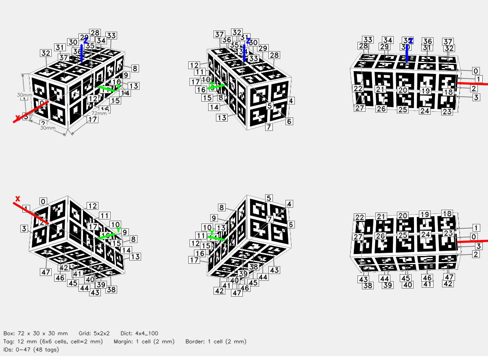

# ArUco Cube — 5x2x2



## Parameters

| Parameter | Value |
|-----------|-------|
| Dictionary | `4x4_100` |
| Grid | 5x2x2 (X x Y x Z tags) |
| Box dimensions | 72 x 30 x 30 mm |
| Tag size | 12 mm (6x6 cells) |
| Cell size | 2 mm |
| Margin | 1 cell (2 mm) |
| Border | 1 cell (2 mm) |
| Total tags | 48 |
| Tag IDs | 0–47 |

## Face Layout

| Face | Tag IDs |
|------|---------|
| +X | 0, 1, 2, 3 |
| -X | 4, 5, 6, 7 |
| +Y | 8, 9, 10, 11, 12, 13, 14, 15, 16, 17 |
| -Y | 18, 19, 20, 21, 22, 23, 24, 25, 26, 27 |
| +Z | 28, 29, 30, 31, 32, 33, 34, 35, 36, 37 |
| -Z | 38, 39, 40, 41, 42, 43, 44, 45, 46, 47 |

## Files

| File | Description |
|------|-------------|
| `cube.3mf` | Multi-color 3MF for Bambu Studio |
| `config.json` | Detector config (used by `detect_cube.py`) |
| `thumbnail.png` | 6-view preview |
| `mujoco/cube.xml` | MuJoCo MJCF model |
| `mujoco/cube.obj` | Wavefront OBJ mesh (UV-mapped) |
| `mujoco/cube.mtl` | OBJ material file |
| `mujoco/cube_atlas.png` | Texture atlas |

## Config JSON

```json
{
  "dict": "4x4_100",
  "grid": "5x2x2",
  "tag_ids": [
    0,
    1,
    2,
    3,
    4,
    5,
    6,
    7,
    8,
    9,
    10,
    11,
    12,
    13,
    14,
    15,
    16,
    17,
    18,
    19,
    20,
    21,
    22,
    23,
    24,
    25,
    26,
    27,
    28,
    29,
    30,
    31,
    32,
    33,
    34,
    35,
    36,
    37,
    38,
    39,
    40,
    41,
    42,
    43,
    44,
    45,
    46,
    47
  ],
  "faces": {
    "+X": [
      0,
      1,
      2,
      3
    ],
    "-X": [
      4,
      5,
      6,
      7
    ],
    "+Y": [
      8,
      9,
      10,
      11,
      12,
      13,
      14,
      15,
      16,
      17
    ],
    "-Y": [
      18,
      19,
      20,
      21,
      22,
      23,
      24,
      25,
      26,
      27
    ],
    "+Z": [
      28,
      29,
      30,
      31,
      32,
      33,
      34,
      35,
      36,
      37
    ],
    "-Z": [
      38,
      39,
      40,
      41,
      42,
      43,
      44,
      45,
      46,
      47
    ]
  },
  "tag_size_mm": 12.0,
  "cell_size_mm": 2.0,
  "margin_cells": 1,
  "border_cells": 1,
  "marker_pixels": 6,
  "box_dims": [
    72.0,
    30.0,
    30.0
  ]
}
```

## Regenerate

```bash
python generate_cube.py --grid 5x2x2 --dict 4x4_100 --tag-size 12 --margin-cell 1 --border-cell 1 -o 5x2x2_12_cube
```
