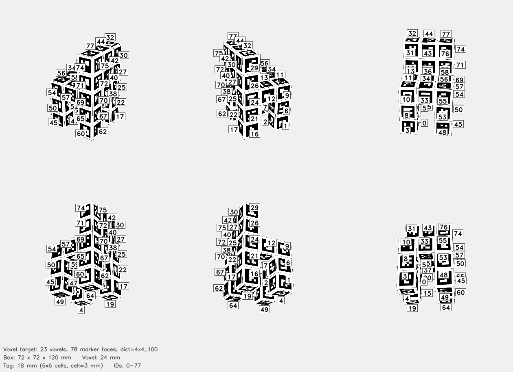

# AprilCube Voxel Target



## Parameters

| Parameter | Value |
|-----------|-------|
| Shape type | `voxel_cuboids` |
| Voxel size | 24 mm |
| Occupied voxels | 23 |
| Box dimensions | 72 x 72 x 120 mm |
| Dictionary | `4x4_100` |
| Tag size | 18 mm |
| Cell size | 3 mm |
| Marker count | 78 |

## Exposed Face Counts

| Face direction | Markers |
|----------------|---------|
| +X | 13 |
| +Y | 17 |
| +Z | 9 |
| -X | 13 |
| -Y | 17 |
| -Z | 9 |

## Files

| File | Description |
|------|-------------|
| `cube.3mf` | Multi-color 3MF target for Bambu Studio |
| `config.json` | Detector config with explicit marker corner coordinates |
| `thumbnail.png` | Preview rendering of exposed voxel-face markers |
| `mujoco/cube.xml` | MuJoCo MJCF model |
| `mujoco/cube.obj` | Wavefront OBJ mesh with UV-mapped marker faces |
| `mujoco/cube.mtl` | OBJ material file |
| `mujoco/cube_atlas.png` | Texture atlas |

## Config JSON

```json
{
  "schema_version": 2,
  "target": {
    "type": "voxel_cuboids",
    "voxel_size_mm": 24.0,
    "occupied_voxels": 23,
    "extent": [
      3,
      3,
      5
    ],
    "origin_index": [
      0,
      0,
      0
    ],
    "cuboids": [
      {
        "name": "front_left_leg",
        "origin": [
          0,
          0,
          0
        ],
        "size": [
          1,
          1,
          2
        ]
      },
      {
        "name": "front_right_leg",
        "origin": [
          2,
          0,
          0
        ],
        "size": [
          1,
          1,
          2
        ]
      },
      {
        "name": "rear_left_leg",
        "origin": [
          0,
          2,
          0
        ],
        "size": [
          1,
          1,
          2
        ]
      },
      {
        "name": "rear_right_leg",
        "origin": [
          2,
          2,
          0
        ],
        "size": [
          1,
          1,
          2
        ]
      },
      {
        "name": "seat",
        "origin": [
          0,
          0,
          2
        ],
        "size": [
          3,
          3,
          1
        ]
      },
      {
        "name": "backrest",
        "origin": [
          0,
          2,
          3
        ],
        "size": [
          3,
          1,
          2
        ]
      }
    ]
  },
  "dict": "4x4_100",
  "grid": "3x3x5",
  "tag_ids": [
    0,
    1,
    2,
    3,
    4,
    5,
    6,
    7,
    8,
    9,
    10,
    11,
    12,
    13,
    14,
    15,
    16,
    17,
    18,
    19,
    20,
    21,
    22,
    23,
    24,
    25,
    26,
    27,
    28,
    29,
    30,
    31,
    32,
    33,
    34,
    35,
    36,
    37,
    38,
    39,
    40,
    41,
    42,
    43,
    44,
    45,
    46,
    47,
    48,
    49,
    50,
    51,
    52,
    53,
    54,
    55,
    56,
    57,
    58,
    59,
    60,
    61,
    62,
    63,
    64,
    65,
    66,
    67,
    68,
    69,
    70,
    71,
    72,
    73,
    74,
    75,
    76,
    77
  ],
  "markers": [
    {
      "id": 0,
      "face": "+X",
      "voxel": [
        0,
        0,
        0
      ],
      "normal": [
        1.0,
        0.0,
        0.0
      ],
      "corners_mm": [
        [
          -12.0,
          -33.0,
          -39.0
        ],
        [
          -12.0,
          -15.0,
          -39.0
        ],
        [
          -12.0,
          -15.0,
          -57.0
        ],
        [
          -12.0,
          -33.0,
          -57.0
        ]
      ],
      "face_corners_mm": [
        [
          -12.0,
          -12.0,
          -36.0
        ],
        [
          -12.0,
          -36.0,
          -36.0
        ],
        [
          -12.0,
          -36.0,
          -60.0
        ],
        [
          -12.0,
          -12.0,
          -60.0
        ]
      ]
    },
    {
      "id": 1,
      "face": "-X",
      "voxel": [
        0,
        0,
        0
      ],
      "normal": [
        -1.0,
        0.0,
        0.0
      ],
      "corners_mm": [
        [
          -36.0,
          -15.0,
          -39.0
        ],
        [
          -36.0,
          -33.0,
          -39.0
        ],
        [
          -36.0,
          -33.0,
          -57.0
        ],
        [
          -36.0,
          -15.0,
          -57.0
        ]
      ],
      "face_corners_mm": [
        [
          -36.0,
          -36.0,
          -36.0
        ],
        [
          -36.0,
          -12.0,
          -36.0
        ],
        [
          -36.0,
          -12.0,
          -60.0
        ],
        [
          -36.0,
          -36.0,
          -60.0
        ]
      ]
    },
    {
      "id": 2,
      "face": "+Y",
      "voxel": [
        0,
        0,
        0
      ],
      "normal": [
        0.0,
        1.0,
        0.0
      ],
      "corners_mm": [
        [
          -15.0,
          -12.0,
          -39.0
        ],
        [
          -33.0,
          -12.0,
          -39.0
        ],
        [
          -33.0,
          -12.0,
          -57.0
        ],
        [
          -15.0,
          -12.0,
          -57.0
        ]
      ],
      "face_corners_mm": [
        [
          -36.0,
          -12.0,
          -36.0
        ],
        [
          -12.0,
          -12.0,
          -36.0
        ],
        [
          -12.0,
          -12.0,
          -60.0
        ],
        [
          -36.0,
          -12.0,
          -60.0
        ]
      ]
    },
    {
      "id": 3,
      "face": "-Y",
      "voxel": [
        0,
        0,
        0
      ],
      "normal": [
        0.0,
        -1.0,
        0.0
      ],
      "corners_mm": [
        [
          -33.0,
          -36.0,
          -39.0
        ],
        [
          -15.0,
          -36.0,
          -39.0
        ],
        [
          -15.0,
          -36.0,
          -57.0
        ],
        [
          -33.0,
          -36.0,
          -57.0
        ]
      ],
      "face_corners_mm": [
        [
          -12.0,
          -36.0,
          -36.0
        ],
        [
          -36.0,
          -36.0,
          -36.0
        ],
        [
          -36.0,
          -36.0,
          -60.0
        ],
        [
          -12.0,
          -36.0,
          -60.0
        ]
      ]
    },
    {
      "id": 4,
      "face": "-Z",
      "voxel": [
        0,
        0,
        0
      ],
      "normal": [
        0.0,
        0.0,
        -1.0
      ],
      "corners_mm": [
        [
          -15.0,
          -15.0,
          -60.0
        ],
        [
          -33.0,
          -15.0,
          -60.0
        ],
        [
          -33.0,
          -33.0,
          -60.0
        ],
        [
          -15.0,
          -33.0,
          -60.0
        ]
      ],
      "face_corners_mm": [
        [
          -36.0,
          -12.0,
          -60.0
        ],
        [
          -12.0,
          -12.0,
          -60.0
        ],
        [
          -12.0,
          -36.0,
          -60.0
        ],
        [
          -36.0,
          -36.0,
          -60.0
        ]
      ]
    },
    {
      "id": 5,
      "face": "+X",
      "voxel": [
        0,
        0,
        1
      ],
      "normal": [
        1.0,
        0.0,
        0.0
      ],
      "corners_mm": [
        [
          -12.0,
          -33.0,
          -15.0
        ],
        [
          -12.0,
          -15.0,
          -15.0
        ],
        [
          -12.0,
          -15.0,
          -33.0
        ],
        [
          -12.0,
          -33.0,
          -33.0
        ]
      ],
      "face_corners_mm": [
        [
          -12.0,
          -12.0,
          -12.0
        ],
        [
          -12.0,
          -36.0,
          -12.0
        ],
        [
          -12.0,
          -36.0,
          -36.0
        ],
        [
          -12.0,
          -12.0,
          -36.0
        ]
      ]
    },
    {
      "id": 6,
      "face": "-X",
      "voxel": [
        0,
        0,
        1
      ],
      "normal": [
        -1.0,
        0.0,
        0.0
      ],
      "corners_mm": [
        [
          -36.0,
          -15.0,
          -15.0
        ],
        [
          -36.0,
          -33.0,
          -15.0
        ],
        [
          -36.0,
          -33.0,
          -33.0
        ],
        [
          -36.0,
          -15.0,
          -33.0
        ]
      ],
      "face_corners_mm": [
        [
          -36.0,
          -36.0,
          -12.0
        ],
        [
          -36.0,
          -12.0,
          -12.0
        ],
        [
          -36.0,
          -12.0,
          -36.0
        ],
        [
          -36.0,
          -36.0,
          -36.0
        ]
      ]
    },
    {
      "id": 7,
      "face": "+Y",
      "voxel": [
        0,
        0,
        1
      ],
      "normal": [
        0.0,
        1.0,
        0.0
      ],
      "corners_mm": [
        [
          -15.0,
          -12.0,
          -15.0
        ],
        [
          -33.0,
          -12.0,
          -15.0
        ],
        [
          -33.0,
          -12.0,
          -33.0
        ],
        [
          -15.0,
          -12.0,
          -33.0
        ]
      ],
      "face_corners_mm": [
        [
          -36.0,
          -12.0,
          -12.0
        ],
        [
          -12.0,
          -12.0,
          -12.0
        ],
        [
          -12.0,
          -12.0,
          -36.0
        ],
        [
          -36.0,
          -12.0,
          -36.0
        ]
      ]
    },
    {
      "id": 8,
      "face": "-Y",
      "voxel": [
        0,
        0,
        1
      ],
      "normal": [
        0.0,
        -1.0,
        0.0
      ],
      "corners_mm": [
        [
          -33.0,
          -36.0,
          -15.0
        ],
        [
          -15.0,
          -36.0,
          -15.0
        ],
        [
          -15.0,
          -36.0,
          -33.0
        ],
        [
          -33.0,
          -36.0,
          -33.0
        ]
      ],
      "face_corners_mm": [
        [
          -12.0,
          -36.0,
          -12.0
        ],
        [
          -36.0,
          -36.0,
          -12.0
        ],
        [
          -36.0,
          -36.0,
          -36.0
        ],
        [
          -12.0,
          -36.0,
          -36.0
        ]
      ]
    },
    {
      "id": 9,
      "face": "-X",
      "voxel": [
        0,
        0,
        2
      ],
      "normal": [
        -1.0,
        0.0,
        0.0
      ],
      "corners_mm": [
        [
          -36.0,
          -15.0,
          9.0
        ],
        [
          -36.0,
          -33.0,
          9.0
        ],
        [
          -36.0,
          -33.0,
          -9.0
        ],
        [
          -36.0,
          -15.0,
          -9.0
        ]
      ],
      "face_corners_mm": [
        [
          -36.0,
          -36.0,
          12.0
        ],
        [
          -36.0,
          -12.0,
          12.0
        ],
        [
          -36.0,
          -12.0,
          -12.0
        ],
        [
          -36.0,
          -36.0,
          -12.0
        ]
      ]
    },
    {
      "id": 10,
      "face": "-Y",
      "voxel": [
        0,
        0,
        2
      ],
      "normal": [
        0.0,
        -1.0,
        0.0
      ],
      "corners_mm": [
        [
          -33.0,
          -36.0,
          9.0
        ],
        [
          -15.0,
          -36.0,
          9.0
        ],
        [
          -15.0,
          -36.0,
          -9.0
        ],
        [
          -33.0,
          -36.0,
          -9.0
        ]
      ],
      "face_corners_mm": [
        [
          -12.0,
          -36.0,
          12.0
        ],
        [
          -36.0,
          -36.0,
          12.0
        ],
        [
          -36.0,
          -36.0,
          -12.0
        ],
        [
          -12.0,
          -36.0,
          -12.0
        ]
      ]
    },
    {
      "id": 11,
      "face": "+Z",
      "voxel": [
        0,
        0,
        2
      ],
      "normal": [
        0.0,
        0.0,
        1.0
      ],
      "corners_mm": [
        [
          -15.0,
          -33.0,
          12.0
        ],
        [
          -33.0,
          -33.0,
          12.0
        ],
        [
          -33.0,
          -15.0,
          12.0
        ],
        [
          -15.0,
          -15.0,
          12.0
        ]
      ],
      "face_corners_mm": [
        [
          -36.0,
          -36.0,
          12.0
        ],
        [
          -12.0,
          -36.0,
          12.0
        ],
        [
          -12.0,
          -12.0,
          12.0
        ],
        [
          -36.0,
          -12.0,
          12.0
        ]
      ]
    },
    {
      "id": 12,
      "face": "-X",
      "voxel": [
        0,
        1,
        2
      ],
      "normal": [
        -1.0,
        0.0,
        0.0
      ],
      "corners_mm": [
        [
          -36.0,
          9.0,
          9.0
        ],
        [
          -36.0,
          -9.0,
          9.0
        ],
        [
          -36.0,
          -9.0,
          -9.0
        ],
        [
          -36.0,
          9.0,
          -9.0
        ]
      ],
      "face_corners_mm": [
        [
          -36.0,
          -12.0,
          12.0
        ],
        [
          -36.0,
          12.0,
          12.0
        ],
        [
          -36.0,
          12.0,
          -12.0
        ],
        [
          -36.0,
          -12.0,
          -12.0
        ]
      ]
    },
    {
      "id": 13,
      "face": "+Z",
      "voxel": [
        0,
        1,
        2
      ],
      "normal": [
        0.0,
        0.0,
        1.0
      ],
      "corners_mm": [
        [
          -15.0,
          -9.0,
          12.0
        ],
        [
          -33.0,
          -9.0,
          12.0
        ],
        [
          -33.0,
          9.0,
          12.0
        ],
        [
          -15.0,
          9.0,
          12.0
        ]
      ],
      "face_corners_mm": [
        [
          -36.0,
          -12.0,
          12.0
        ],
        [
          -12.0,
          -12.0,
          12.0
        ],
        [
          -12.0,
          12.0,
          12.0
        ],
        [
          -36.0,
          12.0,
          12.0
        ]
      ]
    },
    {
      "id": 14,
      "face": "-Z",
      "voxel": [
        0,
        1,
        2
      ],
      "normal": [
        0.0,
        0.0,
        -1.0
      ],
      "corners_mm": [
        [
          -15.0,
          9.0,
          -12.0
        ],
        [
          -33.0,
          9.0,
          -12.0
        ],
        [
          -33.0,
          -9.0,
          -12.0
        ],
        [
          -15.0,
          -9.0,
          -12.0
        ]
      ],
      "face_corners_mm": [
        [
          -36.0,
          12.0,
          -12.0
        ],
        [
          -12.0,
          12.0,
          -12.0
        ],
        [
          -12.0,
          -12.0,
          -12.0
        ],
        [
          -36.0,
          -12.0,
          -12.0
        ]
      ]
    },
    {
      "id": 15,
      "face": "+X",
      "voxel": [
        0,
        2,
        0
      ],
      "normal": [
        1.0,
        0.0,
        0.0
      ],
      "corners_mm": [
        [
          -12.0,
          15.0,
          -39.0
        ],
        [
          -12.0,
          33.0,
          -39.0
        ],
        [
          -12.0,
          33.0,
          -57.0
        ],
        [
          -12.0,
          15.0,
          -57.0
        ]
      ],
      "face_corners_mm": [
        [
          -12.0,
          36.0,
          -36.0
        ],
        [
          -12.0,
          12.0,
          -36.0
        ],
        [
          -12.0,
          12.0,
          -60.0
        ],
        [
          -12.0,
          36.0,
          -60.0
        ]
      ]
    },
    {
      "id": 16,
      "face": "-X",
      "voxel": [
        0,
        2,
        0
      ],
      "normal": [
        -1.0,
        0.0,
        0.0
      ],
      "corners_mm": [
        [
          -36.0,
          33.0,
          -39.0
        ],
        [
          -36.0,
          15.0,
          -39.0
        ],
        [
          -36.0,
          15.0,
          -57.0
        ],
        [
          -36.0,
          33.0,
          -57.0
        ]
      ],
      "face_corners_mm": [
        [
          -36.0,
          12.0,
          -36.0
        ],
        [
          -36.0,
          36.0,
          -36.0
        ],
        [
          -36.0,
          36.0,
          -60.0
        ],
        [
          -36.0,
          12.0,
          -60.0
        ]
      ]
    },
    {
      "id": 17,
      "face": "+Y",
      "voxel": [
        0,
        2,
        0
      ],
      "normal": [
        0.0,
        1.0,
        0.0
      ],
      "corners_mm": [
        [
          -15.0,
          36.0,
          -39.0
        ],
        [
          -33.0,
          36.0,
          -39.0
        ],
        [
          -33.0,
          36.0,
          -57.0
        ],
        [
          -15.0,
          36.0,
          -57.0
        ]
      ],
      "face_corners_mm": [
        [
          -36.0,
          36.0,
          -36.0
        ],
        [
          -12.0,
          36.0,
          -36.0
        ],
        [
          -12.0,
          36.0,
          -60.0
        ],
        [
          -36.0,
          36.0,
          -60.0
        ]
      ]
    },
    {
      "id": 18,
      "face": "-Y",
      "voxel": [
        0,
        2,
        0
      ],
      "normal": [
        0.0,
        -1.0,
        0.0
      ],
      "corners_mm": [
        [
          -33.0,
          12.0,
          -39.0
        ],
        [
          -15.0,
          12.0,
          -39.0
        ],
        [
          -15.0,
          12.0,
          -57.0
        ],
        [
          -33.0,
          12.0,
          -57.0
        ]
      ],
      "face_corners_mm": [
        [
          -12.0,
          12.0,
          -36.0
        ],
        [
          -36.0,
          12.0,
          -36.0
        ],
        [
          -36.0,
          12.0,
          -60.0
        ],
        [
          -12.0,
          12.0,
          -60.0
        ]
      ]
    },
    {
      "id": 19,
      "face": "-Z",
      "voxel": [
        0,
        2,
        0
      ],
      "normal": [
        0.0,
        0.0,
        -1.0
      ],
      "corners_mm": [
        [
          -15.0,
          33.0,
          -60.0
        ],
        [
          -33.0,
          33.0,
          -60.0
        ],
        [
          -33.0,
          15.0,
          -60.0
        ],
        [
          -15.0,
          15.0,
          -60.0
        ]
      ],
      "face_corners_mm": [
        [
          -36.0,
          36.0,
          -60.0
        ],
        [
          -12.0,
          36.0,
          -60.0
        ],
        [
          -12.0,
          12.0,
          -60.0
        ],
        [
          -36.0,
          12.0,
          -60.0
        ]
      ]
    },
    {
      "id": 20,
      "face": "+X",
      "voxel": [
        0,
        2,
        1
      ],
      "normal": [
        1.0,
        0.0,
        0.0
      ],
      "corners_mm": [
        [
          -12.0,
          15.0,
          -15.0
        ],
        [
          -12.0,
          33.0,
          -15.0
        ],
        [
          -12.0,
          33.0,
          -33.0
        ],
        [
          -12.0,
          15.0,
          -33.0
        ]
      ],
      "face_corners_mm": [
        [
          -12.0,
          36.0,
          -12.0
        ],
        [
          -12.0,
          12.0,
          -12.0
        ],
        [
          -12.0,
          12.0,
          -36.0
        ],
        [
          -12.0,
          36.0,
          -36.0
        ]
      ]
    },
    {
      "id": 21,
      "face": "-X",
      "voxel": [
        0,
        2,
        1
      ],
      "normal": [
        -1.0,
        0.0,
        0.0
      ],
      "corners_mm": [
        [
          -36.0,
          33.0,
          -15.0
        ],
        [
          -36.0,
          15.0,
          -15.0
        ],
        [
          -36.0,
          15.0,
          -33.0
        ],
        [
          -36.0,
          33.0,
          -33.0
        ]
      ],
      "face_corners_mm": [
        [
          -36.0,
          12.0,
          -12.0
        ],
        [
          -36.0,
          36.0,
          -12.0
        ],
        [
          -36.0,
          36.0,
          -36.0
        ],
        [
          -36.0,
          12.0,
          -36.0
        ]
      ]
    },
    {
      "id": 22,
      "face": "+Y",
      "voxel": [
        0,
        2,
        1
      ],
      "normal": [
        0.0,
        1.0,
        0.0
      ],
      "corners_mm": [
        [
          -15.0,
          36.0,
          -15.0
        ],
        [
          -33.0,
          36.0,
          -15.0
        ],
        [
          -33.0,
          36.0,
          -33.0
        ],
        [
          -15.0,
          36.0,
          -33.0
        ]
      ],
      "face_corners_mm": [
        [
          -36.0,
          36.0,
          -12.0
        ],
        [
          -12.0,
          36.0,
          -12.0
        ],
        [
          -12.0,
          36.0,
          -36.0
        ],
        [
          -36.0,
          36.0,
          -36.0
        ]
      ]
    },
    {
      "id": 23,
      "face": "-Y",
      "voxel": [
        0,
        2,
        1
      ],
      "normal": [
        0.0,
        -1.0,
        0.0
      ],
      "corners_mm": [
        [
          -33.0,
          12.0,
          -15.0
        ],
        [
          -15.0,
          12.0,
          -15.0
        ],
        [
          -15.0,
          12.0,
          -33.0
        ],
        [
          -33.0,
          12.0,
          -33.0
        ]
      ],
      "face_corners_mm": [
        [
          -12.0,
          12.0,
          -12.0
        ],
        [
          -36.0,
          12.0,
          -12.0
        ],
        [
          -36.0,
          12.0,
          -36.0
        ],
        [
          -12.0,
          12.0,
          -36.0
        ]
      ]
    },
    {
      "id": 24,
      "face": "-X",
      "voxel": [
        0,
        2,
        2
      ],
      "normal": [
        -1.0,
        0.0,
        0.0
      ],
      "corners_mm": [
        [
          -36.0,
          33.0,
          9.0
        ],
        [
          -36.0,
          15.0,
          9.0
        ],
        [
          -36.0,
          15.0,
          -9.0
        ],
        [
          -36.0,
          33.0,
          -9.0
        ]
      ],
      "face_corners_mm": [
        [
          -36.0,
          12.0,
          12.0
        ],
        [
          -36.0,
          36.0,
          12.0
        ],
        [
          -36.0,
          36.0,
          -12.0
        ],
        [
          -36.0,
          12.0,
          -12.0
        ]
      ]
    },
    {
      "id": 25,
      "face": "+Y",
      "voxel": [
        0,
        2,
        2
      ],
      "normal": [
        0.0,
        1.0,
        0.0
      ],
      "corners_mm": [
        [
          -15.0,
          36.0,
          9.0
        ],
        [
          -33.0,
          36.0,
          9.0
        ],
        [
          -33.0,
          36.0,
          -9.0
        ],
        [
          -15.0,
          36.0,
          -9.0
        ]
      ],
      "face_corners_mm": [
        [
          -36.0,
          36.0,
          12.0
        ],
        [
          -12.0,
          36.0,
          12.0
        ],
        [
          -12.0,
          36.0,
          -12.0
        ],
        [
          -36.0,
          36.0,
          -12.0
        ]
      ]
    },
    {
      "id": 26,
      "face": "-X",
      "voxel": [
        0,
        2,
        3
      ],
      "normal": [
        -1.0,
        0.0,
        0.0
      ],
      "corners_mm": [
        [
          -36.0,
          33.0,
          33.0
        ],
        [
          -36.0,
          15.0,
          33.0
        ],
        [
          -36.0,
          15.0,
          15.0
        ],
        [
          -36.0,
          33.0,
          15.0
        ]
      ],
      "face_corners_mm": [
        [
          -36.0,
          12.0,
          36.0
        ],
        [
          -36.0,
          36.0,
          36.0
        ],
        [
          -36.0,
          36.0,
          12.0
        ],
        [
          -36.0,
          12.0,
          12.0
        ]
      ]
    },
    {
      "id": 27,
      "face": "+Y",
      "voxel": [
        0,
        2,
        3
      ],
      "normal": [
        0.0,
        1.0,
        0.0
      ],
      "corners_mm": [
        [
          -15.0,
          36.0,
          33.0
        ],
        [
          -33.0,
          36.0,
          33.0
        ],
        [
          -33.0,
          36.0,
          15.0
        ],
        [
          -15.0,
          36.0,
          15.0
        ]
      ],
      "face_corners_mm": [
        [
          -36.0,
          36.0,
          36.0
        ],
        [
          -12.0,
          36.0,
          36.0
        ],
        [
          -12.0,
          36.0,
          12.0
        ],
        [
          -36.0,
          36.0,
          12.0
        ]
      ]
    },
    {
      "id": 28,
      "face": "-Y",
      "voxel": [
        0,
        2,
        3
      ],
      "normal": [
        0.0,
        -1.0,
        0.0
      ],
      "corners_mm": [
        [
          -33.0,
          12.0,
          33.0
        ],
        [
          -15.0,
          12.0,
          33.0
        ],
        [
          -15.0,
          12.0,
          15.0
        ],
        [
          -33.0,
          12.0,
          15.0
        ]
      ],
      "face_corners_mm": [
        [
          -12.0,
          12.0,
          36.0
        ],
        [
          -36.0,
          12.0,
          36.0
        ],
        [
          -36.0,
          12.0,
          12.0
        ],
        [
          -12.0,
          12.0,
          12.0
        ]
      ]
    },
    {
      "id": 29,
      "face": "-X",
      "voxel": [
        0,
        2,
        4
      ],
      "normal": [
        -1.0,
        0.0,
        0.0
      ],
      "corners_mm": [
        [
          -36.0,
          33.0,
          57.0
        ],
        [
          -36.0,
          15.0,
          57.0
        ],
        [
          -36.0,
          15.0,
          39.0
        ],
        [
          -36.0,
          33.0,
          39.0
        ]
      ],
      "face_corners_mm": [
        [
          -36.0,
          12.0,
          60.0
        ],
        [
          -36.0,
          36.0,
          60.0
        ],
        [
          -36.0,
          36.0,
          36.0
        ],
        [
          -36.0,
          12.0,
          36.0
        ]
      ]
    },
    {
      "id": 30,
      "face": "+Y",
      "voxel": [
        0,
        2,
        4
      ],
      "normal": [
        0.0,
        1.0,
        0.0
      ],
      "corners_mm": [
        [
          -15.0,
          36.0,
          57.0
        ],
        [
          -33.0,
          36.0,
          57.0
        ],
        [
          -33.0,
          36.0,
          39.0
        ],
        [
          -15.0,
          36.0,
          39.0
        ]
      ],
      "face_corners_mm": [
        [
          -36.0,
          36.0,
          60.0
        ],
        [
          -12.0,
          36.0,
          60.0
        ],
        [
          -12.0,
          36.0,
          36.0
        ],
        [
          -36.0,
          36.0,
          36.0
        ]
      ]
    },
    {
      "id": 31,
      "face": "-Y",
      "voxel": [
        0,
        2,
        4
      ],
      "normal": [
        0.0,
        -1.0,
        0.0
      ],
      "corners_mm": [
        [
          -33.0,
          12.0,
          57.0
        ],
        [
          -15.0,
          12.0,
          57.0
        ],
        [
          -15.0,
          12.0,
          39.0
        ],
        [
          -33.0,
          12.0,
          39.0
        ]
      ],
      "face_corners_mm": [
        [
          -12.0,
          12.0,
          60.0
        ],
        [
          -36.0,
          12.0,
          60.0
        ],
        [
          -36.0,
          12.0,
          36.0
        ],
        [
          -12.0,
          12.0,
          36.0
        ]
      ]
    },
    {
      "id": 32,
      "face": "+Z",
      "voxel": [
        0,
        2,
        4
      ],
      "normal": [
        0.0,
        0.0,
        1.0
      ],
      "corners_mm": [
        [
          -15.0,
          15.0,
          60.0
        ],
        [
          -33.0,
          15.0,
          60.0
        ],
        [
          -33.0,
          33.0,
          60.0
        ],
        [
          -15.0,
          33.0,
          60.0
        ]
      ],
      "face_corners_mm": [
        [
          -36.0,
          12.0,
          60.0
        ],
        [
          -12.0,
          12.0,
          60.0
        ],
        [
          -12.0,
          36.0,
          60.0
        ],
        [
          -36.0,
          36.0,
          60.0
        ]
      ]
    },
    {
      "id": 33,
      "face": "-Y",
      "voxel": [
        1,
        0,
        2
      ],
      "normal": [
        0.0,
        -1.0,
        0.0
      ],
      "corners_mm": [
        [
          -9.0,
          -36.0,
          9.0
        ],
        [
          9.0,
          -36.0,
          9.0
        ],
        [
          9.0,
          -36.0,
          -9.0
        ],
        [
          -9.0,
          -36.0,
          -9.0
        ]
      ],
      "face_corners_mm": [
        [
          12.0,
          -36.0,
          12.0
        ],
        [
          -12.0,
          -36.0,
          12.0
        ],
        [
          -12.0,
          -36.0,
          -12.0
        ],
        [
          12.0,
          -36.0,
          -12.0
        ]
      ]
    },
    {
      "id": 34,
      "face": "+Z",
      "voxel": [
        1,
        0,
        2
      ],
      "normal": [
        0.0,
        0.0,
        1.0
      ],
      "corners_mm": [
        [
          9.0,
          -33.0,
          12.0
        ],
        [
          -9.0,
          -33.0,
          12.0
        ],
        [
          -9.0,
          -15.0,
          12.0
        ],
        [
          9.0,
          -15.0,
          12.0
        ]
      ],
      "face_corners_mm": [
        [
          -12.0,
          -36.0,
          12.0
        ],
        [
          12.0,
          -36.0,
          12.0
        ],
        [
          12.0,
          -12.0,
          12.0
        ],
        [
          -12.0,
          -12.0,
          12.0
        ]
      ]
    },
    {
      "id": 35,
      "face": "-Z",
      "voxel": [
        1,
        0,
        2
      ],
      "normal": [
        0.0,
        0.0,
        -1.0
      ],
      "corners_mm": [
        [
          9.0,
          -15.0,
          -12.0
        ],
        [
          -9.0,
          -15.0,
          -12.0
        ],
        [
          -9.0,
          -33.0,
          -12.0
        ],
        [
          9.0,
          -33.0,
          -12.0
        ]
      ],
      "face_corners_mm": [
        [
          -12.0,
          -12.0,
          -12.0
        ],
        [
          12.0,
          -12.0,
          -12.0
        ],
        [
          12.0,
          -36.0,
          -12.0
        ],
        [
          -12.0,
          -36.0,
          -12.0
        ]
      ]
    },
    {
      "id": 36,
      "face": "+Z",
      "voxel": [
        1,
        1,
        2
      ],
      "normal": [
        0.0,
        0.0,
        1.0
      ],
      "corners_mm": [
        [
          9.0,
          -9.0,
          12.0
        ],
        [
          -9.0,
          -9.0,
          12.0
        ],
        [
          -9.0,
          9.0,
          12.0
        ],
        [
          9.0,
          9.0,
          12.0
        ]
      ],
      "face_corners_mm": [
        [
          -12.0,
          -12.0,
          12.0
        ],
        [
          12.0,
          -12.0,
          12.0
        ],
        [
          12.0,
          12.0,
          12.0
        ],
        [
          -12.0,
          12.0,
          12.0
        ]
      ]
    },
    {
      "id": 37,
      "face": "-Z",
      "voxel": [
        1,
        1,
        2
      ],
      "normal": [
        0.0,
        0.0,
        -1.0
      ],
      "corners_mm": [
        [
          9.0,
          9.0,
          -12.0
        ],
        [
          -9.0,
          9.0,
          -12.0
        ],
        [
          -9.0,
          -9.0,
          -12.0
        ],
        [
          9.0,
          -9.0,
          -12.0
        ]
      ],
      "face_corners_mm": [
        [
          -12.0,
          12.0,
          -12.0
        ],
        [
          12.0,
          12.0,
          -12.0
        ],
        [
          12.0,
          -12.0,
          -12.0
        ],
        [
          -12.0,
          -12.0,
          -12.0
        ]
      ]
    },
    {
      "id": 38,
      "face": "+Y",
      "voxel": [
        1,
        2,
        2
      ],
      "normal": [
        0.0,
        1.0,
        0.0
      ],
      "corners_mm": [
        [
          9.0,
          36.0,
          9.0
        ],
        [
          -9.0,
          36.0,
          9.0
        ],
        [
          -9.0,
          36.0,
          -9.0
        ],
        [
          9.0,
          36.0,
          -9.0
        ]
      ],
      "face_corners_mm": [
        [
          -12.0,
          36.0,
          12.0
        ],
        [
          12.0,
          36.0,
          12.0
        ],
        [
          12.0,
          36.0,
          -12.0
        ],
        [
          -12.0,
          36.0,
          -12.0
        ]
      ]
    },
    {
      "id": 39,
      "face": "-Z",
      "voxel": [
        1,
        2,
        2
      ],
      "normal": [
        0.0,
        0.0,
        -1.0
      ],
      "corners_mm": [
        [
          9.0,
          33.0,
          -12.0
        ],
        [
          -9.0,
          33.0,
          -12.0
        ],
        [
          -9.0,
          15.0,
          -12.0
        ],
        [
          9.0,
          15.0,
          -12.0
        ]
      ],
      "face_corners_mm": [
        [
          -12.0,
          36.0,
          -12.0
        ],
        [
          12.0,
          36.0,
          -12.0
        ],
        [
          12.0,
          12.0,
          -12.0
        ],
        [
          -12.0,
          12.0,
          -12.0
        ]
      ]
    },
    {
      "id": 40,
      "face": "+Y",
      "voxel": [
        1,
        2,
        3
      ],
      "normal": [
        0.0,
        1.0,
        0.0
      ],
      "corners_mm": [
        [
          9.0,
          36.0,
          33.0
        ],
        [
          -9.0,
          36.0,
          33.0
        ],
        [
          -9.0,
          36.0,
          15.0
        ],
        [
          9.0,
          36.0,
          15.0
        ]
      ],
      "face_corners_mm": [
        [
          -12.0,
          36.0,
          36.0
        ],
        [
          12.0,
          36.0,
          36.0
        ],
        [
          12.0,
          36.0,
          12.0
        ],
        [
          -12.0,
          36.0,
          12.0
        ]
      ]
    },
    {
      "id": 41,
      "face": "-Y",
      "voxel": [
        1,
        2,
        3
      ],
      "normal": [
        0.0,
        -1.0,
        0.0
      ],
      "corners_mm": [
        [
          -9.0,
          12.0,
          33.0
        ],
        [
          9.0,
          12.0,
          33.0
        ],
        [
          9.0,
          12.0,
          15.0
        ],
        [
          -9.0,
          12.0,
          15.0
        ]
      ],
      "face_corners_mm": [
        [
          12.0,
          12.0,
          36.0
        ],
        [
          -12.0,
          12.0,
          36.0
        ],
        [
          -12.0,
          12.0,
          12.0
        ],
        [
          12.0,
          12.0,
          12.0
        ]
      ]
    },
    {
      "id": 42,
      "face": "+Y",
      "voxel": [
        1,
        2,
        4
      ],
      "normal": [
        0.0,
        1.0,
        0.0
      ],
      "corners_mm": [
        [
          9.0,
          36.0,
          57.0
        ],
        [
          -9.0,
          36.0,
          57.0
        ],
        [
          -9.0,
          36.0,
          39.0
        ],
        [
          9.0,
          36.0,
          39.0
        ]
      ],
      "face_corners_mm": [
        [
          -12.0,
          36.0,
          60.0
        ],
        [
          12.0,
          36.0,
          60.0
        ],
        [
          12.0,
          36.0,
          36.0
        ],
        [
          -12.0,
          36.0,
          36.0
        ]
      ]
    },
    {
      "id": 43,
      "face": "-Y",
      "voxel": [
        1,
        2,
        4
      ],
      "normal": [
        0.0,
        -1.0,
        0.0
      ],
      "corners_mm": [
        [
          -9.0,
          12.0,
          57.0
        ],
        [
          9.0,
          12.0,
          57.0
        ],
        [
          9.0,
          12.0,
          39.0
        ],
        [
          -9.0,
          12.0,
          39.0
        ]
      ],
      "face_corners_mm": [
        [
          12.0,
          12.0,
          60.0
        ],
        [
          -12.0,
          12.0,
          60.0
        ],
        [
          -12.0,
          12.0,
          36.0
        ],
        [
          12.0,
          12.0,
          36.0
        ]
      ]
    },
    {
      "id": 44,
      "face": "+Z",
      "voxel": [
        1,
        2,
        4
      ],
      "normal": [
        0.0,
        0.0,
        1.0
      ],
      "corners_mm": [
        [
          9.0,
          15.0,
          60.0
        ],
        [
          -9.0,
          15.0,
          60.0
        ],
        [
          -9.0,
          33.0,
          60.0
        ],
        [
          9.0,
          33.0,
          60.0
        ]
      ],
      "face_corners_mm": [
        [
          -12.0,
          12.0,
          60.0
        ],
        [
          12.0,
          12.0,
          60.0
        ],
        [
          12.0,
          36.0,
          60.0
        ],
        [
          -12.0,
          36.0,
          60.0
        ]
      ]
    },
    {
      "id": 45,
      "face": "+X",
      "voxel": [
        2,
        0,
        0
      ],
      "normal": [
        1.0,
        0.0,
        0.0
      ],
      "corners_mm": [
        [
          36.0,
          -33.0,
          -39.0
        ],
        [
          36.0,
          -15.0,
          -39.0
        ],
        [
          36.0,
          -15.0,
          -57.0
        ],
        [
          36.0,
          -33.0,
          -57.0
        ]
      ],
      "face_corners_mm": [
        [
          36.0,
          -12.0,
          -36.0
        ],
        [
          36.0,
          -36.0,
          -36.0
        ],
        [
          36.0,
          -36.0,
          -60.0
        ],
        [
          36.0,
          -12.0,
          -60.0
        ]
      ]
    },
    {
      "id": 46,
      "face": "-X",
      "voxel": [
        2,
        0,
        0
      ],
      "normal": [
        -1.0,
        0.0,
        0.0
      ],
      "corners_mm": [
        [
          12.0,
          -15.0,
          -39.0
        ],
        [
          12.0,
          -33.0,
          -39.0
        ],
        [
          12.0,
          -33.0,
          -57.0
        ],
        [
          12.0,
          -15.0,
          -57.0
        ]
      ],
      "face_corners_mm": [
        [
          12.0,
          -36.0,
          -36.0
        ],
        [
          12.0,
          -12.0,
          -36.0
        ],
        [
          12.0,
          -12.0,
          -60.0
        ],
        [
          12.0,
          -36.0,
          -60.0
        ]
      ]
    },
    {
      "id": 47,
      "face": "+Y",
      "voxel": [
        2,
        0,
        0
      ],
      "normal": [
        0.0,
        1.0,
        0.0
      ],
      "corners_mm": [
        [
          33.0,
          -12.0,
          -39.0
        ],
        [
          15.0,
          -12.0,
          -39.0
        ],
        [
          15.0,
          -12.0,
          -57.0
        ],
        [
          33.0,
          -12.0,
          -57.0
        ]
      ],
      "face_corners_mm": [
        [
          12.0,
          -12.0,
          -36.0
        ],
        [
          36.0,
          -12.0,
          -36.0
        ],
        [
          36.0,
          -12.0,
          -60.0
        ],
        [
          12.0,
          -12.0,
          -60.0
        ]
      ]
    },
    {
      "id": 48,
      "face": "-Y",
      "voxel": [
        2,
        0,
        0
      ],
      "normal": [
        0.0,
        -1.0,
        0.0
      ],
      "corners_mm": [
        [
          15.0,
          -36.0,
          -39.0
        ],
        [
          33.0,
          -36.0,
          -39.0
        ],
        [
          33.0,
          -36.0,
          -57.0
        ],
        [
          15.0,
          -36.0,
          -57.0
        ]
      ],
      "face_corners_mm": [
        [
          36.0,
          -36.0,
          -36.0
        ],
        [
          12.0,
          -36.0,
          -36.0
        ],
        [
          12.0,
          -36.0,
          -60.0
        ],
        [
          36.0,
          -36.0,
          -60.0
        ]
      ]
    },
    {
      "id": 49,
      "face": "-Z",
      "voxel": [
        2,
        0,
        0
      ],
      "normal": [
        0.0,
        0.0,
        -1.0
      ],
      "corners_mm": [
        [
          33.0,
          -15.0,
          -60.0
        ],
        [
          15.0,
          -15.0,
          -60.0
        ],
        [
          15.0,
          -33.0,
          -60.0
        ],
        [
          33.0,
          -33.0,
          -60.0
        ]
      ],
      "face_corners_mm": [
        [
          12.0,
          -12.0,
          -60.0
        ],
        [
          36.0,
          -12.0,
          -60.0
        ],
        [
          36.0,
          -36.0,
          -60.0
        ],
        [
          12.0,
          -36.0,
          -60.0
        ]
      ]
    },
    {
      "id": 50,
      "face": "+X",
      "voxel": [
        2,
        0,
        1
      ],
      "normal": [
        1.0,
        0.0,
        0.0
      ],
      "corners_mm": [
        [
          36.0,
          -33.0,
          -15.0
        ],
        [
          36.0,
          -15.0,
          -15.0
        ],
        [
          36.0,
          -15.0,
          -33.0
        ],
        [
          36.0,
          -33.0,
          -33.0
        ]
      ],
      "face_corners_mm": [
        [
          36.0,
          -12.0,
          -12.0
        ],
        [
          36.0,
          -36.0,
          -12.0
        ],
        [
          36.0,
          -36.0,
          -36.0
        ],
        [
          36.0,
          -12.0,
          -36.0
        ]
      ]
    },
    {
      "id": 51,
      "face": "-X",
      "voxel": [
        2,
        0,
        1
      ],
      "normal": [
        -1.0,
        0.0,
        0.0
      ],
      "corners_mm": [
        [
          12.0,
          -15.0,
          -15.0
        ],
        [
          12.0,
          -33.0,
          -15.0
        ],
        [
          12.0,
          -33.0,
          -33.0
        ],
        [
          12.0,
          -15.0,
          -33.0
        ]
      ],
      "face_corners_mm": [
        [
          12.0,
          -36.0,
          -12.0
        ],
        [
          12.0,
          -12.0,
          -12.0
        ],
        [
          12.0,
          -12.0,
          -36.0
        ],
        [
          12.0,
          -36.0,
          -36.0
        ]
      ]
    },
    {
      "id": 52,
      "face": "+Y",
      "voxel": [
        2,
        0,
        1
      ],
      "normal": [
        0.0,
        1.0,
        0.0
      ],
      "corners_mm": [
        [
          33.0,
          -12.0,
          -15.0
        ],
        [
          15.0,
          -12.0,
          -15.0
        ],
        [
          15.0,
          -12.0,
          -33.0
        ],
        [
          33.0,
          -12.0,
          -33.0
        ]
      ],
      "face_corners_mm": [
        [
          12.0,
          -12.0,
          -12.0
        ],
        [
          36.0,
          -12.0,
          -12.0
        ],
        [
          36.0,
          -12.0,
          -36.0
        ],
        [
          12.0,
          -12.0,
          -36.0
        ]
      ]
    },
    {
      "id": 53,
      "face": "-Y",
      "voxel": [
        2,
        0,
        1
      ],
      "normal": [
        0.0,
        -1.0,
        0.0
      ],
      "corners_mm": [
        [
          15.0,
          -36.0,
          -15.0
        ],
        [
          33.0,
          -36.0,
          -15.0
        ],
        [
          33.0,
          -36.0,
          -33.0
        ],
        [
          15.0,
          -36.0,
          -33.0
        ]
      ],
      "face_corners_mm": [
        [
          36.0,
          -36.0,
          -12.0
        ],
        [
          12.0,
          -36.0,
          -12.0
        ],
        [
          12.0,
          -36.0,
          -36.0
        ],
        [
          36.0,
          -36.0,
          -36.0
        ]
      ]
    },
    {
      "id": 54,
      "face": "+X",
      "voxel": [
        2,
        0,
        2
      ],
      "normal": [
        1.0,
        0.0,
        0.0
      ],
      "corners_mm": [
        [
          36.0,
          -33.0,
          9.0
        ],
        [
          36.0,
          -15.0,
          9.0
        ],
        [
          36.0,
          -15.0,
          -9.0
        ],
        [
          36.0,
          -33.0,
          -9.0
        ]
      ],
      "face_corners_mm": [
        [
          36.0,
          -12.0,
          12.0
        ],
        [
          36.0,
          -36.0,
          12.0
        ],
        [
          36.0,
          -36.0,
          -12.0
        ],
        [
          36.0,
          -12.0,
          -12.0
        ]
      ]
    },
    {
      "id": 55,
      "face": "-Y",
      "voxel": [
        2,
        0,
        2
      ],
      "normal": [
        0.0,
        -1.0,
        0.0
      ],
      "corners_mm": [
        [
          15.0,
          -36.0,
          9.0
        ],
        [
          33.0,
          -36.0,
          9.0
        ],
        [
          33.0,
          -36.0,
          -9.0
        ],
        [
          15.0,
          -36.0,
          -9.0
        ]
      ],
      "face_corners_mm": [
        [
          36.0,
          -36.0,
          12.0
        ],
        [
          12.0,
          -36.0,
          12.0
        ],
        [
          12.0,
          -36.0,
          -12.0
        ],
        [
          36.0,
          -36.0,
          -12.0
        ]
      ]
    },
    {
      "id": 56,
      "face": "+Z",
      "voxel": [
        2,
        0,
        2
      ],
      "normal": [
        0.0,
        0.0,
        1.0
      ],
      "corners_mm": [
        [
          33.0,
          -33.0,
          12.0
        ],
        [
          15.0,
          -33.0,
          12.0
        ],
        [
          15.0,
          -15.0,
          12.0
        ],
        [
          33.0,
          -15.0,
          12.0
        ]
      ],
      "face_corners_mm": [
        [
          12.0,
          -36.0,
          12.0
        ],
        [
          36.0,
          -36.0,
          12.0
        ],
        [
          36.0,
          -12.0,
          12.0
        ],
        [
          12.0,
          -12.0,
          12.0
        ]
      ]
    },
    {
      "id": 57,
      "face": "+X",
      "voxel": [
        2,
        1,
        2
      ],
      "normal": [
        1.0,
        0.0,
        0.0
      ],
      "corners_mm": [
        [
          36.0,
          -9.0,
          9.0
        ],
        [
          36.0,
          9.0,
          9.0
        ],
        [
          36.0,
          9.0,
          -9.0
        ],
        [
          36.0,
          -9.0,
          -9.0
        ]
      ],
      "face_corners_mm": [
        [
          36.0,
          12.0,
          12.0
        ],
        [
          36.0,
          -12.0,
          12.0
        ],
        [
          36.0,
          -12.0,
          -12.0
        ],
        [
          36.0,
          12.0,
          -12.0
        ]
      ]
    },
    {
      "id": 58,
      "face": "+Z",
      "voxel": [
        2,
        1,
        2
      ],
      "normal": [
        0.0,
        0.0,
        1.0
      ],
      "corners_mm": [
        [
          33.0,
          -9.0,
          12.0
        ],
        [
          15.0,
          -9.0,
          12.0
        ],
        [
          15.0,
          9.0,
          12.0
        ],
        [
          33.0,
          9.0,
          12.0
        ]
      ],
      "face_corners_mm": [
        [
          12.0,
          -12.0,
          12.0
        ],
        [
          36.0,
          -12.0,
          12.0
        ],
        [
          36.0,
          12.0,
          12.0
        ],
        [
          12.0,
          12.0,
          12.0
        ]
      ]
    },
    {
      "id": 59,
      "face": "-Z",
      "voxel": [
        2,
        1,
        2
      ],
      "normal": [
        0.0,
        0.0,
        -1.0
      ],
      "corners_mm": [
        [
          33.0,
          9.0,
          -12.0
        ],
        [
          15.0,
          9.0,
          -12.0
        ],
        [
          15.0,
          -9.0,
          -12.0
        ],
        [
          33.0,
          -9.0,
          -12.0
        ]
      ],
      "face_corners_mm": [
        [
          12.0,
          12.0,
          -12.0
        ],
        [
          36.0,
          12.0,
          -12.0
        ],
        [
          36.0,
          -12.0,
          -12.0
        ],
        [
          12.0,
          -12.0,
          -12.0
        ]
      ]
    },
    {
      "id": 60,
      "face": "+X",
      "voxel": [
        2,
        2,
        0
      ],
      "normal": [
        1.0,
        0.0,
        0.0
      ],
      "corners_mm": [
        [
          36.0,
          15.0,
          -39.0
        ],
        [
          36.0,
          33.0,
          -39.0
        ],
        [
          36.0,
          33.0,
          -57.0
        ],
        [
          36.0,
          15.0,
          -57.0
        ]
      ],
      "face_corners_mm": [
        [
          36.0,
          36.0,
          -36.0
        ],
        [
          36.0,
          12.0,
          -36.0
        ],
        [
          36.0,
          12.0,
          -60.0
        ],
        [
          36.0,
          36.0,
          -60.0
        ]
      ]
    },
    {
      "id": 61,
      "face": "-X",
      "voxel": [
        2,
        2,
        0
      ],
      "normal": [
        -1.0,
        0.0,
        0.0
      ],
      "corners_mm": [
        [
          12.0,
          33.0,
          -39.0
        ],
        [
          12.0,
          15.0,
          -39.0
        ],
        [
          12.0,
          15.0,
          -57.0
        ],
        [
          12.0,
          33.0,
          -57.0
        ]
      ],
      "face_corners_mm": [
        [
          12.0,
          12.0,
          -36.0
        ],
        [
          12.0,
          36.0,
          -36.0
        ],
        [
          12.0,
          36.0,
          -60.0
        ],
        [
          12.0,
          12.0,
          -60.0
        ]
      ]
    },
    {
      "id": 62,
      "face": "+Y",
      "voxel": [
        2,
        2,
        0
      ],
      "normal": [
        0.0,
        1.0,
        0.0
      ],
      "corners_mm": [
        [
          33.0,
          36.0,
          -39.0
        ],
        [
          15.0,
          36.0,
          -39.0
        ],
        [
          15.0,
          36.0,
          -57.0
        ],
        [
          33.0,
          36.0,
          -57.0
        ]
      ],
      "face_corners_mm": [
        [
          12.0,
          36.0,
          -36.0
        ],
        [
          36.0,
          36.0,
          -36.0
        ],
        [
          36.0,
          36.0,
          -60.0
        ],
        [
          12.0,
          36.0,
          -60.0
        ]
      ]
    },
    {
      "id": 63,
      "face": "-Y",
      "voxel": [
        2,
        2,
        0
      ],
      "normal": [
        0.0,
        -1.0,
        0.0
      ],
      "corners_mm": [
        [
          15.0,
          12.0,
          -39.0
        ],
        [
          33.0,
          12.0,
          -39.0
        ],
        [
          33.0,
          12.0,
          -57.0
        ],
        [
          15.0,
          12.0,
          -57.0
        ]
      ],
      "face_corners_mm": [
        [
          36.0,
          12.0,
          -36.0
        ],
        [
          12.0,
          12.0,
          -36.0
        ],
        [
          12.0,
          12.0,
          -60.0
        ],
        [
          36.0,
          12.0,
          -60.0
        ]
      ]
    },
    {
      "id": 64,
      "face": "-Z",
      "voxel": [
        2,
        2,
        0
      ],
      "normal": [
        0.0,
        0.0,
        -1.0
      ],
      "corners_mm": [
        [
          33.0,
          33.0,
          -60.0
        ],
        [
          15.0,
          33.0,
          -60.0
        ],
        [
          15.0,
          15.0,
          -60.0
        ],
        [
          33.0,
          15.0,
          -60.0
        ]
      ],
      "face_corners_mm": [
        [
          12.0,
          36.0,
          -60.0
        ],
        [
          36.0,
          36.0,
          -60.0
        ],
        [
          36.0,
          12.0,
          -60.0
        ],
        [
          12.0,
          12.0,
          -60.0
        ]
      ]
    },
    {
      "id": 65,
      "face": "+X",
      "voxel": [
        2,
        2,
        1
      ],
      "normal": [
        1.0,
        0.0,
        0.0
      ],
      "corners_mm": [
        [
          36.0,
          15.0,
          -15.0
        ],
        [
          36.0,
          33.0,
          -15.0
        ],
        [
          36.0,
          33.0,
          -33.0
        ],
        [
          36.0,
          15.0,
          -33.0
        ]
      ],
      "face_corners_mm": [
        [
          36.0,
          36.0,
          -12.0
        ],
        [
          36.0,
          12.0,
          -12.0
        ],
        [
          36.0,
          12.0,
          -36.0
        ],
        [
          36.0,
          36.0,
          -36.0
        ]
      ]
    },
    {
      "id": 66,
      "face": "-X",
      "voxel": [
        2,
        2,
        1
      ],
      "normal": [
        -1.0,
        0.0,
        0.0
      ],
      "corners_mm": [
        [
          12.0,
          33.0,
          -15.0
        ],
        [
          12.0,
          15.0,
          -15.0
        ],
        [
          12.0,
          15.0,
          -33.0
        ],
        [
          12.0,
          33.0,
          -33.0
        ]
      ],
      "face_corners_mm": [
        [
          12.0,
          12.0,
          -12.0
        ],
        [
          12.0,
          36.0,
          -12.0
        ],
        [
          12.0,
          36.0,
          -36.0
        ],
        [
          12.0,
          12.0,
          -36.0
        ]
      ]
    },
    {
      "id": 67,
      "face": "+Y",
      "voxel": [
        2,
        2,
        1
      ],
      "normal": [
        0.0,
        1.0,
        0.0
      ],
      "corners_mm": [
        [
          33.0,
          36.0,
          -15.0
        ],
        [
          15.0,
          36.0,
          -15.0
        ],
        [
          15.0,
          36.0,
          -33.0
        ],
        [
          33.0,
          36.0,
          -33.0
        ]
      ],
      "face_corners_mm": [
        [
          12.0,
          36.0,
          -12.0
        ],
        [
          36.0,
          36.0,
          -12.0
        ],
        [
          36.0,
          36.0,
          -36.0
        ],
        [
          12.0,
          36.0,
          -36.0
        ]
      ]
    },
    {
      "id": 68,
      "face": "-Y",
      "voxel": [
        2,
        2,
        1
      ],
      "normal": [
        0.0,
        -1.0,
        0.0
      ],
      "corners_mm": [
        [
          15.0,
          12.0,
          -15.0
        ],
        [
          33.0,
          12.0,
          -15.0
        ],
        [
          33.0,
          12.0,
          -33.0
        ],
        [
          15.0,
          12.0,
          -33.0
        ]
      ],
      "face_corners_mm": [
        [
          36.0,
          12.0,
          -12.0
        ],
        [
          12.0,
          12.0,
          -12.0
        ],
        [
          12.0,
          12.0,
          -36.0
        ],
        [
          36.0,
          12.0,
          -36.0
        ]
      ]
    },
    {
      "id": 69,
      "face": "+X",
      "voxel": [
        2,
        2,
        2
      ],
      "normal": [
        1.0,
        0.0,
        0.0
      ],
      "corners_mm": [
        [
          36.0,
          15.0,
          9.0
        ],
        [
          36.0,
          33.0,
          9.0
        ],
        [
          36.0,
          33.0,
          -9.0
        ],
        [
          36.0,
          15.0,
          -9.0
        ]
      ],
      "face_corners_mm": [
        [
          36.0,
          36.0,
          12.0
        ],
        [
          36.0,
          12.0,
          12.0
        ],
        [
          36.0,
          12.0,
          -12.0
        ],
        [
          36.0,
          36.0,
          -12.0
        ]
      ]
    },
    {
      "id": 70,
      "face": "+Y",
      "voxel": [
        2,
        2,
        2
      ],
      "normal": [
        0.0,
        1.0,
        0.0
      ],
      "corners_mm": [
        [
          33.0,
          36.0,
          9.0
        ],
        [
          15.0,
          36.0,
          9.0
        ],
        [
          15.0,
          36.0,
          -9.0
        ],
        [
          33.0,
          36.0,
          -9.0
        ]
      ],
      "face_corners_mm": [
        [
          12.0,
          36.0,
          12.0
        ],
        [
          36.0,
          36.0,
          12.0
        ],
        [
          36.0,
          36.0,
          -12.0
        ],
        [
          12.0,
          36.0,
          -12.0
        ]
      ]
    },
    {
      "id": 71,
      "face": "+X",
      "voxel": [
        2,
        2,
        3
      ],
      "normal": [
        1.0,
        0.0,
        0.0
      ],
      "corners_mm": [
        [
          36.0,
          15.0,
          33.0
        ],
        [
          36.0,
          33.0,
          33.0
        ],
        [
          36.0,
          33.0,
          15.0
        ],
        [
          36.0,
          15.0,
          15.0
        ]
      ],
      "face_corners_mm": [
        [
          36.0,
          36.0,
          36.0
        ],
        [
          36.0,
          12.0,
          36.0
        ],
        [
          36.0,
          12.0,
          12.0
        ],
        [
          36.0,
          36.0,
          12.0
        ]
      ]
    },
    {
      "id": 72,
      "face": "+Y",
      "voxel": [
        2,
        2,
        3
      ],
      "normal": [
        0.0,
        1.0,
        0.0
      ],
      "corners_mm": [
        [
          33.0,
          36.0,
          33.0
        ],
        [
          15.0,
          36.0,
          33.0
        ],
        [
          15.0,
          36.0,
          15.0
        ],
        [
          33.0,
          36.0,
          15.0
        ]
      ],
      "face_corners_mm": [
        [
          12.0,
          36.0,
          36.0
        ],
        [
          36.0,
          36.0,
          36.0
        ],
        [
          36.0,
          36.0,
          12.0
        ],
        [
          12.0,
          36.0,
          12.0
        ]
      ]
    },
    {
      "id": 73,
      "face": "-Y",
      "voxel": [
        2,
        2,
        3
      ],
      "normal": [
        0.0,
        -1.0,
        0.0
      ],
      "corners_mm": [
        [
          15.0,
          12.0,
          33.0
        ],
        [
          33.0,
          12.0,
          33.0
        ],
        [
          33.0,
          12.0,
          15.0
        ],
        [
          15.0,
          12.0,
          15.0
        ]
      ],
      "face_corners_mm": [
        [
          36.0,
          12.0,
          36.0
        ],
        [
          12.0,
          12.0,
          36.0
        ],
        [
          12.0,
          12.0,
          12.0
        ],
        [
          36.0,
          12.0,
          12.0
        ]
      ]
    },
    {
      "id": 74,
      "face": "+X",
      "voxel": [
        2,
        2,
        4
      ],
      "normal": [
        1.0,
        0.0,
        0.0
      ],
      "corners_mm": [
        [
          36.0,
          15.0,
          57.0
        ],
        [
          36.0,
          33.0,
          57.0
        ],
        [
          36.0,
          33.0,
          39.0
        ],
        [
          36.0,
          15.0,
          39.0
        ]
      ],
      "face_corners_mm": [
        [
          36.0,
          36.0,
          60.0
        ],
        [
          36.0,
          12.0,
          60.0
        ],
        [
          36.0,
          12.0,
          36.0
        ],
        [
          36.0,
          36.0,
          36.0
        ]
      ]
    },
    {
      "id": 75,
      "face": "+Y",
      "voxel": [
        2,
        2,
        4
      ],
      "normal": [
        0.0,
        1.0,
        0.0
      ],
      "corners_mm": [
        [
          33.0,
          36.0,
          57.0
        ],
        [
          15.0,
          36.0,
          57.0
        ],
        [
          15.0,
          36.0,
          39.0
        ],
        [
          33.0,
          36.0,
          39.0
        ]
      ],
      "face_corners_mm": [
        [
          12.0,
          36.0,
          60.0
        ],
        [
          36.0,
          36.0,
          60.0
        ],
        [
          36.0,
          36.0,
          36.0
        ],
        [
          12.0,
          36.0,
          36.0
        ]
      ]
    },
    {
      "id": 76,
      "face": "-Y",
      "voxel": [
        2,
        2,
        4
      ],
      "normal": [
        0.0,
        -1.0,
        0.0
      ],
      "corners_mm": [
        [
          15.0,
          12.0,
          57.0
        ],
        [
          33.0,
          12.0,
          57.0
        ],
        [
          33.0,
          12.0,
          39.0
        ],
        [
          15.0,
          12.0,
          39.0
        ]
      ],
      "face_corners_mm": [
        [
          36.0,
          12.0,
          60.0
        ],
        [
          12.0,
          12.0,
          60.0
        ],
        [
          12.0,
          12.0,
          36.0
        ],
        [
          36.0,
          12.0,
          36.0
        ]
      ]
    },
    {
      "id": 77,
      "face": "+Z",
      "voxel": [
        2,
        2,
        4
      ],
      "normal": [
        0.0,
        0.0,
        1.0
      ],
      "corners_mm": [
        [
          33.0,
          15.0,
          60.0
        ],
        [
          15.0,
          15.0,
          60.0
        ],
        [
          15.0,
          33.0,
          60.0
        ],
        [
          33.0,
          33.0,
          60.0
        ]
      ],
      "face_corners_mm": [
        [
          12.0,
          12.0,
          60.0
        ],
        [
          36.0,
          12.0,
          60.0
        ],
        [
          36.0,
          36.0,
          60.0
        ],
        [
          12.0,
          36.0,
          60.0
        ]
      ]
    }
  ],
  "tag_size_mm": 18.0,
  "cell_size_mm": 3.0,
  "margin_cells": 1,
  "border_cells": 1,
  "marker_pixels": 6,
  "box_dims": [
    72.0,
    72.0,
    120.0
  ]
}
```
