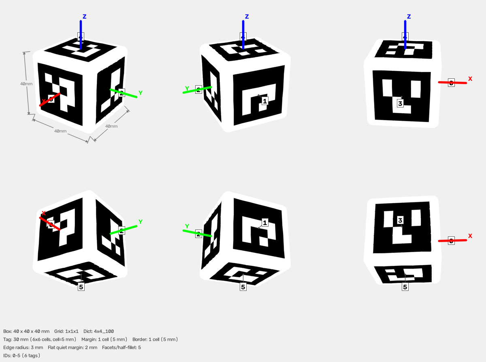

# ArUco Cube — 1x1x1



## Parameters

| Parameter | Value |
|-----------|-------|
| Dictionary | `4x4_100` |
| Grid | 1x1x1 (X x Y x Z tags) |
| Box dimensions | 40 x 40 x 40 mm |
| Tag size | 30 mm (6x6 cells) |
| Cell size | 5 mm |
| Margin | 1 cell (5 mm) |
| Border | 1 cell (5 mm) |
| Edge/corner radius | 3 mm |
| Total tags | 6 |
| Tag IDs | 0–5 |

## Face Layout

| Face | Tag IDs |
|------|---------|
| +X | 0 |
| -X | 1 |
| +Y | 2 |
| -Y | 3 |
| +Z | 4 |
| -Z | 5 |

## Files

| File | Description |
|------|-------------|
| `cube.3mf` | Multi-color 3MF for Bambu Studio |
| `config.json` | Detector config (used by `detect_cube.py`) |
| `thumbnail.png` | 6-view preview |
| `mujoco/cube.xml` | MuJoCo MJCF model |
| `mujoco/cube.obj` | Wavefront OBJ mesh (UV-mapped) |
| `mujoco/cube.mtl` | OBJ material file |
| `mujoco/cube_atlas.png` | Texture atlas |


## Rounded-target print setup

- The marker planes remain flat; the minimum planar face span is 34 mm.
- Print on one flat face with a 0.4 mm nozzle and 0.20 mm layers.
- Start with 4 wall loops and 15-20% gyroid infill.
- Enable build-plate-only supports beneath the lower rounded perimeter. Keep support painting outside the 30 mm marker plane.
- Place the Z seam on a rounded edge/corner, not through a marker.
- After support removal, deburr or sand only the rounded white perimeter (400-600 grit). Do not sand a marker plane.
- Map filament 1 to black PLA and filament 2 to white PLA.


## Config JSON

```json
{
  "schema_version": 1,
  "target": {
    "type": "cuboid",
    "grid": "1x1x1"
  },
  "dict": "4x4_100",
  "grid": "1x1x1",
  "tag_ids": [
    0,
    1,
    2,
    3,
    4,
    5
  ],
  "faces": {
    "+X": [
      0
    ],
    "-X": [
      1
    ],
    "+Y": [
      2
    ],
    "-Y": [
      3
    ],
    "+Z": [
      4
    ],
    "-Z": [
      5
    ]
  },
  "tag_size_mm": 30.0,
  "cell_size_mm": 5.0,
  "margin_cells": 1,
  "border_cells": 1,
  "edge_radius_mm": 3.0,
  "edge_segments": 5,
  "marker_pixels": 6,
  "box_dims": [
    40.0,
    40.0,
    40.0
  ]
}
```

## Regenerate

```bash
aprilcube generate --grid 1x1x1 --dict 4x4_100 --tag-size 30 --margin-cell 1 --border-cell 1 --edge-radius 3 --edge-segments 5 -o dex3_safe_cube
```
