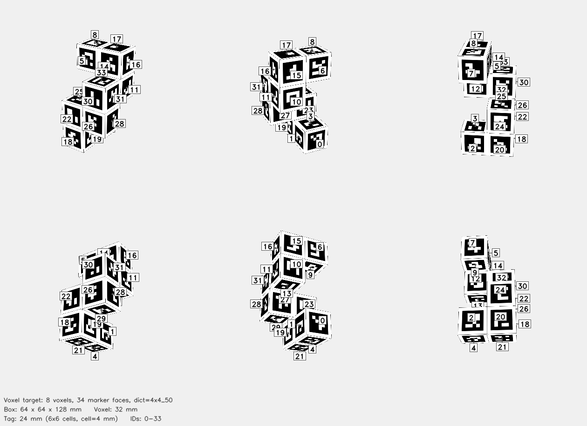

# AprilCube Voxel Target



## Parameters

| Parameter | Value |
|-----------|-------|
| Shape type | `voxel_cuboids` |
| Voxel size | 32 mm |
| Occupied voxels | 8 |
| Box dimensions | 64 x 64 x 128 mm |
| Dictionary | `4x4_50` |
| Tag size | 24 mm |
| Cell size | 4 mm |
| Marker count | 34 |

## Exposed Face Counts

| Face direction | Markers |
|----------------|---------|
| +X | 6 |
| +Y | 6 |
| +Z | 5 |
| -X | 6 |
| -Y | 6 |
| -Z | 5 |

## Files

| File | Description |
|------|-------------|
| `cube.3mf` | Multi-color 3MF target for Bambu Studio |
| `config.json` | Detector config with explicit marker corner coordinates |
| `thumbnail.png` | Preview rendering of exposed voxel-face markers |
| `mujoco/cube.xml` | MuJoCo MJCF model |
| `mujoco/cube.obj` | Wavefront OBJ mesh with UV-mapped marker faces |
| `mujoco/cube.mtl` | OBJ material file |
| `mujoco/cube_atlas.png` | Texture atlas |

## Config JSON

```json
{
  "schema_version": 2,
  "target": {
    "type": "voxel_cuboids",
    "voxel_size_mm": 32.0,
    "occupied_voxels": 8,
    "extent": [
      2,
      2,
      4
    ],
    "origin_index": [
      0,
      0,
      0
    ],
    "cuboids": [
      {
        "name": "step_0_front",
        "origin": [
          0,
          0,
          0
        ],
        "size": [
          2,
          1,
          1
        ]
      },
      {
        "name": "step_1_right",
        "origin": [
          1,
          0,
          1
        ],
        "size": [
          1,
          2,
          1
        ]
      },
      {
        "name": "step_2_back",
        "origin": [
          0,
          1,
          2
        ],
        "size": [
          2,
          1,
          1
        ]
      },
      {
        "name": "step_3_left",
        "origin": [
          0,
          0,
          3
        ],
        "size": [
          1,
          2,
          1
        ]
      }
    ]
  },
  "dict": "4x4_50",
  "grid": "2x2x4",
  "tag_ids": [
    0,
    1,
    2,
    3,
    4,
    5,
    6,
    7,
    8,
    9,
    10,
    11,
    12,
    13,
    14,
    15,
    16,
    17,
    18,
    19,
    20,
    21,
    22,
    23,
    24,
    25,
    26,
    27,
    28,
    29,
    30,
    31,
    32,
    33
  ],
  "markers": [
    {
      "id": 0,
      "face": "-X",
      "voxel": [
        0,
        0,
        0
      ],
      "normal": [
        -1.0,
        0.0,
        0.0
      ],
      "corners_mm": [
        [
          -32.0,
          -4.0,
          -36.0
        ],
        [
          -32.0,
          -28.0,
          -36.0
        ],
        [
          -32.0,
          -28.0,
          -60.0
        ],
        [
          -32.0,
          -4.0,
          -60.0
        ]
      ],
      "face_corners_mm": [
        [
          -32.0,
          -32.0,
          -32.0
        ],
        [
          -32.0,
          0.0,
          -32.0
        ],
        [
          -32.0,
          0.0,
          -64.0
        ],
        [
          -32.0,
          -32.0,
          -64.0
        ]
      ]
    },
    {
      "id": 1,
      "face": "+Y",
      "voxel": [
        0,
        0,
        0
      ],
      "normal": [
        0.0,
        1.0,
        0.0
      ],
      "corners_mm": [
        [
          -4.0,
          0.0,
          -36.0
        ],
        [
          -28.0,
          0.0,
          -36.0
        ],
        [
          -28.0,
          0.0,
          -60.0
        ],
        [
          -4.0,
          0.0,
          -60.0
        ]
      ],
      "face_corners_mm": [
        [
          -32.0,
          0.0,
          -32.0
        ],
        [
          0.0,
          0.0,
          -32.0
        ],
        [
          0.0,
          0.0,
          -64.0
        ],
        [
          -32.0,
          0.0,
          -64.0
        ]
      ]
    },
    {
      "id": 2,
      "face": "-Y",
      "voxel": [
        0,
        0,
        0
      ],
      "normal": [
        0.0,
        -1.0,
        0.0
      ],
      "corners_mm": [
        [
          -28.0,
          -32.0,
          -36.0
        ],
        [
          -4.0,
          -32.0,
          -36.0
        ],
        [
          -4.0,
          -32.0,
          -60.0
        ],
        [
          -28.0,
          -32.0,
          -60.0
        ]
      ],
      "face_corners_mm": [
        [
          0.0,
          -32.0,
          -32.0
        ],
        [
          -32.0,
          -32.0,
          -32.0
        ],
        [
          -32.0,
          -32.0,
          -64.0
        ],
        [
          0.0,
          -32.0,
          -64.0
        ]
      ]
    },
    {
      "id": 3,
      "face": "+Z",
      "voxel": [
        0,
        0,
        0
      ],
      "normal": [
        0.0,
        0.0,
        1.0
      ],
      "corners_mm": [
        [
          -4.0,
          -28.0,
          -32.0
        ],
        [
          -28.0,
          -28.0,
          -32.0
        ],
        [
          -28.0,
          -4.0,
          -32.0
        ],
        [
          -4.0,
          -4.0,
          -32.0
        ]
      ],
      "face_corners_mm": [
        [
          -32.0,
          -32.0,
          -32.0
        ],
        [
          0.0,
          -32.0,
          -32.0
        ],
        [
          0.0,
          0.0,
          -32.0
        ],
        [
          -32.0,
          0.0,
          -32.0
        ]
      ]
    },
    {
      "id": 4,
      "face": "-Z",
      "voxel": [
        0,
        0,
        0
      ],
      "normal": [
        0.0,
        0.0,
        -1.0
      ],
      "corners_mm": [
        [
          -4.0,
          -4.0,
          -64.0
        ],
        [
          -28.0,
          -4.0,
          -64.0
        ],
        [
          -28.0,
          -28.0,
          -64.0
        ],
        [
          -4.0,
          -28.0,
          -64.0
        ]
      ],
      "face_corners_mm": [
        [
          -32.0,
          0.0,
          -64.0
        ],
        [
          0.0,
          0.0,
          -64.0
        ],
        [
          0.0,
          -32.0,
          -64.0
        ],
        [
          -32.0,
          -32.0,
          -64.0
        ]
      ]
    },
    {
      "id": 5,
      "face": "+X",
      "voxel": [
        0,
        0,
        3
      ],
      "normal": [
        1.0,
        0.0,
        0.0
      ],
      "corners_mm": [
        [
          0.0,
          -28.0,
          60.0
        ],
        [
          0.0,
          -4.0,
          60.0
        ],
        [
          0.0,
          -4.0,
          36.0
        ],
        [
          0.0,
          -28.0,
          36.0
        ]
      ],
      "face_corners_mm": [
        [
          0.0,
          0.0,
          64.0
        ],
        [
          0.0,
          -32.0,
          64.0
        ],
        [
          0.0,
          -32.0,
          32.0
        ],
        [
          0.0,
          0.0,
          32.0
        ]
      ]
    },
    {
      "id": 6,
      "face": "-X",
      "voxel": [
        0,
        0,
        3
      ],
      "normal": [
        -1.0,
        0.0,
        0.0
      ],
      "corners_mm": [
        [
          -32.0,
          -4.0,
          60.0
        ],
        [
          -32.0,
          -28.0,
          60.0
        ],
        [
          -32.0,
          -28.0,
          36.0
        ],
        [
          -32.0,
          -4.0,
          36.0
        ]
      ],
      "face_corners_mm": [
        [
          -32.0,
          -32.0,
          64.0
        ],
        [
          -32.0,
          0.0,
          64.0
        ],
        [
          -32.0,
          0.0,
          32.0
        ],
        [
          -32.0,
          -32.0,
          32.0
        ]
      ]
    },
    {
      "id": 7,
      "face": "-Y",
      "voxel": [
        0,
        0,
        3
      ],
      "normal": [
        0.0,
        -1.0,
        0.0
      ],
      "corners_mm": [
        [
          -28.0,
          -32.0,
          60.0
        ],
        [
          -4.0,
          -32.0,
          60.0
        ],
        [
          -4.0,
          -32.0,
          36.0
        ],
        [
          -28.0,
          -32.0,
          36.0
        ]
      ],
      "face_corners_mm": [
        [
          0.0,
          -32.0,
          64.0
        ],
        [
          -32.0,
          -32.0,
          64.0
        ],
        [
          -32.0,
          -32.0,
          32.0
        ],
        [
          0.0,
          -32.0,
          32.0
        ]
      ]
    },
    {
      "id": 8,
      "face": "+Z",
      "voxel": [
        0,
        0,
        3
      ],
      "normal": [
        0.0,
        0.0,
        1.0
      ],
      "corners_mm": [
        [
          -4.0,
          -28.0,
          64.0
        ],
        [
          -28.0,
          -28.0,
          64.0
        ],
        [
          -28.0,
          -4.0,
          64.0
        ],
        [
          -4.0,
          -4.0,
          64.0
        ]
      ],
      "face_corners_mm": [
        [
          -32.0,
          -32.0,
          64.0
        ],
        [
          0.0,
          -32.0,
          64.0
        ],
        [
          0.0,
          0.0,
          64.0
        ],
        [
          -32.0,
          0.0,
          64.0
        ]
      ]
    },
    {
      "id": 9,
      "face": "-Z",
      "voxel": [
        0,
        0,
        3
      ],
      "normal": [
        0.0,
        0.0,
        -1.0
      ],
      "corners_mm": [
        [
          -4.0,
          -4.0,
          32.0
        ],
        [
          -28.0,
          -4.0,
          32.0
        ],
        [
          -28.0,
          -28.0,
          32.0
        ],
        [
          -4.0,
          -28.0,
          32.0
        ]
      ],
      "face_corners_mm": [
        [
          -32.0,
          0.0,
          32.0
        ],
        [
          0.0,
          0.0,
          32.0
        ],
        [
          0.0,
          -32.0,
          32.0
        ],
        [
          -32.0,
          -32.0,
          32.0
        ]
      ]
    },
    {
      "id": 10,
      "face": "-X",
      "voxel": [
        0,
        1,
        2
      ],
      "normal": [
        -1.0,
        0.0,
        0.0
      ],
      "corners_mm": [
        [
          -32.0,
          28.0,
          28.0
        ],
        [
          -32.0,
          4.0,
          28.0
        ],
        [
          -32.0,
          4.0,
          4.0
        ],
        [
          -32.0,
          28.0,
          4.0
        ]
      ],
      "face_corners_mm": [
        [
          -32.0,
          0.0,
          32.0
        ],
        [
          -32.0,
          32.0,
          32.0
        ],
        [
          -32.0,
          32.0,
          0.0
        ],
        [
          -32.0,
          0.0,
          0.0
        ]
      ]
    },
    {
      "id": 11,
      "face": "+Y",
      "voxel": [
        0,
        1,
        2
      ],
      "normal": [
        0.0,
        1.0,
        0.0
      ],
      "corners_mm": [
        [
          -4.0,
          32.0,
          28.0
        ],
        [
          -28.0,
          32.0,
          28.0
        ],
        [
          -28.0,
          32.0,
          4.0
        ],
        [
          -4.0,
          32.0,
          4.0
        ]
      ],
      "face_corners_mm": [
        [
          -32.0,
          32.0,
          32.0
        ],
        [
          0.0,
          32.0,
          32.0
        ],
        [
          0.0,
          32.0,
          0.0
        ],
        [
          -32.0,
          32.0,
          0.0
        ]
      ]
    },
    {
      "id": 12,
      "face": "-Y",
      "voxel": [
        0,
        1,
        2
      ],
      "normal": [
        0.0,
        -1.0,
        0.0
      ],
      "corners_mm": [
        [
          -28.0,
          0.0,
          28.0
        ],
        [
          -4.0,
          0.0,
          28.0
        ],
        [
          -4.0,
          0.0,
          4.0
        ],
        [
          -28.0,
          0.0,
          4.0
        ]
      ],
      "face_corners_mm": [
        [
          0.0,
          0.0,
          32.0
        ],
        [
          -32.0,
          0.0,
          32.0
        ],
        [
          -32.0,
          0.0,
          0.0
        ],
        [
          0.0,
          0.0,
          0.0
        ]
      ]
    },
    {
      "id": 13,
      "face": "-Z",
      "voxel": [
        0,
        1,
        2
      ],
      "normal": [
        0.0,
        0.0,
        -1.0
      ],
      "corners_mm": [
        [
          -4.0,
          28.0,
          0.0
        ],
        [
          -28.0,
          28.0,
          0.0
        ],
        [
          -28.0,
          4.0,
          0.0
        ],
        [
          -4.0,
          4.0,
          0.0
        ]
      ],
      "face_corners_mm": [
        [
          -32.0,
          32.0,
          0.0
        ],
        [
          0.0,
          32.0,
          0.0
        ],
        [
          0.0,
          0.0,
          0.0
        ],
        [
          -32.0,
          0.0,
          0.0
        ]
      ]
    },
    {
      "id": 14,
      "face": "+X",
      "voxel": [
        0,
        1,
        3
      ],
      "normal": [
        1.0,
        0.0,
        0.0
      ],
      "corners_mm": [
        [
          0.0,
          4.0,
          60.0
        ],
        [
          0.0,
          28.0,
          60.0
        ],
        [
          0.0,
          28.0,
          36.0
        ],
        [
          0.0,
          4.0,
          36.0
        ]
      ],
      "face_corners_mm": [
        [
          0.0,
          32.0,
          64.0
        ],
        [
          0.0,
          0.0,
          64.0
        ],
        [
          0.0,
          0.0,
          32.0
        ],
        [
          0.0,
          32.0,
          32.0
        ]
      ]
    },
    {
      "id": 15,
      "face": "-X",
      "voxel": [
        0,
        1,
        3
      ],
      "normal": [
        -1.0,
        0.0,
        0.0
      ],
      "corners_mm": [
        [
          -32.0,
          28.0,
          60.0
        ],
        [
          -32.0,
          4.0,
          60.0
        ],
        [
          -32.0,
          4.0,
          36.0
        ],
        [
          -32.0,
          28.0,
          36.0
        ]
      ],
      "face_corners_mm": [
        [
          -32.0,
          0.0,
          64.0
        ],
        [
          -32.0,
          32.0,
          64.0
        ],
        [
          -32.0,
          32.0,
          32.0
        ],
        [
          -32.0,
          0.0,
          32.0
        ]
      ]
    },
    {
      "id": 16,
      "face": "+Y",
      "voxel": [
        0,
        1,
        3
      ],
      "normal": [
        0.0,
        1.0,
        0.0
      ],
      "corners_mm": [
        [
          -4.0,
          32.0,
          60.0
        ],
        [
          -28.0,
          32.0,
          60.0
        ],
        [
          -28.0,
          32.0,
          36.0
        ],
        [
          -4.0,
          32.0,
          36.0
        ]
      ],
      "face_corners_mm": [
        [
          -32.0,
          32.0,
          64.0
        ],
        [
          0.0,
          32.0,
          64.0
        ],
        [
          0.0,
          32.0,
          32.0
        ],
        [
          -32.0,
          32.0,
          32.0
        ]
      ]
    },
    {
      "id": 17,
      "face": "+Z",
      "voxel": [
        0,
        1,
        3
      ],
      "normal": [
        0.0,
        0.0,
        1.0
      ],
      "corners_mm": [
        [
          -4.0,
          4.0,
          64.0
        ],
        [
          -28.0,
          4.0,
          64.0
        ],
        [
          -28.0,
          28.0,
          64.0
        ],
        [
          -4.0,
          28.0,
          64.0
        ]
      ],
      "face_corners_mm": [
        [
          -32.0,
          0.0,
          64.0
        ],
        [
          0.0,
          0.0,
          64.0
        ],
        [
          0.0,
          32.0,
          64.0
        ],
        [
          -32.0,
          32.0,
          64.0
        ]
      ]
    },
    {
      "id": 18,
      "face": "+X",
      "voxel": [
        1,
        0,
        0
      ],
      "normal": [
        1.0,
        0.0,
        0.0
      ],
      "corners_mm": [
        [
          32.0,
          -28.0,
          -36.0
        ],
        [
          32.0,
          -4.0,
          -36.0
        ],
        [
          32.0,
          -4.0,
          -60.0
        ],
        [
          32.0,
          -28.0,
          -60.0
        ]
      ],
      "face_corners_mm": [
        [
          32.0,
          0.0,
          -32.0
        ],
        [
          32.0,
          -32.0,
          -32.0
        ],
        [
          32.0,
          -32.0,
          -64.0
        ],
        [
          32.0,
          0.0,
          -64.0
        ]
      ]
    },
    {
      "id": 19,
      "face": "+Y",
      "voxel": [
        1,
        0,
        0
      ],
      "normal": [
        0.0,
        1.0,
        0.0
      ],
      "corners_mm": [
        [
          28.0,
          0.0,
          -36.0
        ],
        [
          4.0,
          0.0,
          -36.0
        ],
        [
          4.0,
          0.0,
          -60.0
        ],
        [
          28.0,
          0.0,
          -60.0
        ]
      ],
      "face_corners_mm": [
        [
          0.0,
          0.0,
          -32.0
        ],
        [
          32.0,
          0.0,
          -32.0
        ],
        [
          32.0,
          0.0,
          -64.0
        ],
        [
          0.0,
          0.0,
          -64.0
        ]
      ]
    },
    {
      "id": 20,
      "face": "-Y",
      "voxel": [
        1,
        0,
        0
      ],
      "normal": [
        0.0,
        -1.0,
        0.0
      ],
      "corners_mm": [
        [
          4.0,
          -32.0,
          -36.0
        ],
        [
          28.0,
          -32.0,
          -36.0
        ],
        [
          28.0,
          -32.0,
          -60.0
        ],
        [
          4.0,
          -32.0,
          -60.0
        ]
      ],
      "face_corners_mm": [
        [
          32.0,
          -32.0,
          -32.0
        ],
        [
          0.0,
          -32.0,
          -32.0
        ],
        [
          0.0,
          -32.0,
          -64.0
        ],
        [
          32.0,
          -32.0,
          -64.0
        ]
      ]
    },
    {
      "id": 21,
      "face": "-Z",
      "voxel": [
        1,
        0,
        0
      ],
      "normal": [
        0.0,
        0.0,
        -1.0
      ],
      "corners_mm": [
        [
          28.0,
          -4.0,
          -64.0
        ],
        [
          4.0,
          -4.0,
          -64.0
        ],
        [
          4.0,
          -28.0,
          -64.0
        ],
        [
          28.0,
          -28.0,
          -64.0
        ]
      ],
      "face_corners_mm": [
        [
          0.0,
          0.0,
          -64.0
        ],
        [
          32.0,
          0.0,
          -64.0
        ],
        [
          32.0,
          -32.0,
          -64.0
        ],
        [
          0.0,
          -32.0,
          -64.0
        ]
      ]
    },
    {
      "id": 22,
      "face": "+X",
      "voxel": [
        1,
        0,
        1
      ],
      "normal": [
        1.0,
        0.0,
        0.0
      ],
      "corners_mm": [
        [
          32.0,
          -28.0,
          -4.0
        ],
        [
          32.0,
          -4.0,
          -4.0
        ],
        [
          32.0,
          -4.0,
          -28.0
        ],
        [
          32.0,
          -28.0,
          -28.0
        ]
      ],
      "face_corners_mm": [
        [
          32.0,
          0.0,
          0.0
        ],
        [
          32.0,
          -32.0,
          0.0
        ],
        [
          32.0,
          -32.0,
          -32.0
        ],
        [
          32.0,
          0.0,
          -32.0
        ]
      ]
    },
    {
      "id": 23,
      "face": "-X",
      "voxel": [
        1,
        0,
        1
      ],
      "normal": [
        -1.0,
        0.0,
        0.0
      ],
      "corners_mm": [
        [
          0.0,
          -4.0,
          -4.0
        ],
        [
          0.0,
          -28.0,
          -4.0
        ],
        [
          0.0,
          -28.0,
          -28.0
        ],
        [
          0.0,
          -4.0,
          -28.0
        ]
      ],
      "face_corners_mm": [
        [
          0.0,
          -32.0,
          0.0
        ],
        [
          0.0,
          0.0,
          0.0
        ],
        [
          0.0,
          0.0,
          -32.0
        ],
        [
          0.0,
          -32.0,
          -32.0
        ]
      ]
    },
    {
      "id": 24,
      "face": "-Y",
      "voxel": [
        1,
        0,
        1
      ],
      "normal": [
        0.0,
        -1.0,
        0.0
      ],
      "corners_mm": [
        [
          4.0,
          -32.0,
          -4.0
        ],
        [
          28.0,
          -32.0,
          -4.0
        ],
        [
          28.0,
          -32.0,
          -28.0
        ],
        [
          4.0,
          -32.0,
          -28.0
        ]
      ],
      "face_corners_mm": [
        [
          32.0,
          -32.0,
          0.0
        ],
        [
          0.0,
          -32.0,
          0.0
        ],
        [
          0.0,
          -32.0,
          -32.0
        ],
        [
          32.0,
          -32.0,
          -32.0
        ]
      ]
    },
    {
      "id": 25,
      "face": "+Z",
      "voxel": [
        1,
        0,
        1
      ],
      "normal": [
        0.0,
        0.0,
        1.0
      ],
      "corners_mm": [
        [
          28.0,
          -28.0,
          0.0
        ],
        [
          4.0,
          -28.0,
          0.0
        ],
        [
          4.0,
          -4.0,
          0.0
        ],
        [
          28.0,
          -4.0,
          0.0
        ]
      ],
      "face_corners_mm": [
        [
          0.0,
          -32.0,
          0.0
        ],
        [
          32.0,
          -32.0,
          0.0
        ],
        [
          32.0,
          0.0,
          0.0
        ],
        [
          0.0,
          0.0,
          0.0
        ]
      ]
    },
    {
      "id": 26,
      "face": "+X",
      "voxel": [
        1,
        1,
        1
      ],
      "normal": [
        1.0,
        0.0,
        0.0
      ],
      "corners_mm": [
        [
          32.0,
          4.0,
          -4.0
        ],
        [
          32.0,
          28.0,
          -4.0
        ],
        [
          32.0,
          28.0,
          -28.0
        ],
        [
          32.0,
          4.0,
          -28.0
        ]
      ],
      "face_corners_mm": [
        [
          32.0,
          32.0,
          0.0
        ],
        [
          32.0,
          0.0,
          0.0
        ],
        [
          32.0,
          0.0,
          -32.0
        ],
        [
          32.0,
          32.0,
          -32.0
        ]
      ]
    },
    {
      "id": 27,
      "face": "-X",
      "voxel": [
        1,
        1,
        1
      ],
      "normal": [
        -1.0,
        0.0,
        0.0
      ],
      "corners_mm": [
        [
          0.0,
          28.0,
          -4.0
        ],
        [
          0.0,
          4.0,
          -4.0
        ],
        [
          0.0,
          4.0,
          -28.0
        ],
        [
          0.0,
          28.0,
          -28.0
        ]
      ],
      "face_corners_mm": [
        [
          0.0,
          0.0,
          0.0
        ],
        [
          0.0,
          32.0,
          0.0
        ],
        [
          0.0,
          32.0,
          -32.0
        ],
        [
          0.0,
          0.0,
          -32.0
        ]
      ]
    },
    {
      "id": 28,
      "face": "+Y",
      "voxel": [
        1,
        1,
        1
      ],
      "normal": [
        0.0,
        1.0,
        0.0
      ],
      "corners_mm": [
        [
          28.0,
          32.0,
          -4.0
        ],
        [
          4.0,
          32.0,
          -4.0
        ],
        [
          4.0,
          32.0,
          -28.0
        ],
        [
          28.0,
          32.0,
          -28.0
        ]
      ],
      "face_corners_mm": [
        [
          0.0,
          32.0,
          0.0
        ],
        [
          32.0,
          32.0,
          0.0
        ],
        [
          32.0,
          32.0,
          -32.0
        ],
        [
          0.0,
          32.0,
          -32.0
        ]
      ]
    },
    {
      "id": 29,
      "face": "-Z",
      "voxel": [
        1,
        1,
        1
      ],
      "normal": [
        0.0,
        0.0,
        -1.0
      ],
      "corners_mm": [
        [
          28.0,
          28.0,
          -32.0
        ],
        [
          4.0,
          28.0,
          -32.0
        ],
        [
          4.0,
          4.0,
          -32.0
        ],
        [
          28.0,
          4.0,
          -32.0
        ]
      ],
      "face_corners_mm": [
        [
          0.0,
          32.0,
          -32.0
        ],
        [
          32.0,
          32.0,
          -32.0
        ],
        [
          32.0,
          0.0,
          -32.0
        ],
        [
          0.0,
          0.0,
          -32.0
        ]
      ]
    },
    {
      "id": 30,
      "face": "+X",
      "voxel": [
        1,
        1,
        2
      ],
      "normal": [
        1.0,
        0.0,
        0.0
      ],
      "corners_mm": [
        [
          32.0,
          4.0,
          28.0
        ],
        [
          32.0,
          28.0,
          28.0
        ],
        [
          32.0,
          28.0,
          4.0
        ],
        [
          32.0,
          4.0,
          4.0
        ]
      ],
      "face_corners_mm": [
        [
          32.0,
          32.0,
          32.0
        ],
        [
          32.0,
          0.0,
          32.0
        ],
        [
          32.0,
          0.0,
          0.0
        ],
        [
          32.0,
          32.0,
          0.0
        ]
      ]
    },
    {
      "id": 31,
      "face": "+Y",
      "voxel": [
        1,
        1,
        2
      ],
      "normal": [
        0.0,
        1.0,
        0.0
      ],
      "corners_mm": [
        [
          28.0,
          32.0,
          28.0
        ],
        [
          4.0,
          32.0,
          28.0
        ],
        [
          4.0,
          32.0,
          4.0
        ],
        [
          28.0,
          32.0,
          4.0
        ]
      ],
      "face_corners_mm": [
        [
          0.0,
          32.0,
          32.0
        ],
        [
          32.0,
          32.0,
          32.0
        ],
        [
          32.0,
          32.0,
          0.0
        ],
        [
          0.0,
          32.0,
          0.0
        ]
      ]
    },
    {
      "id": 32,
      "face": "-Y",
      "voxel": [
        1,
        1,
        2
      ],
      "normal": [
        0.0,
        -1.0,
        0.0
      ],
      "corners_mm": [
        [
          4.0,
          0.0,
          28.0
        ],
        [
          28.0,
          0.0,
          28.0
        ],
        [
          28.0,
          0.0,
          4.0
        ],
        [
          4.0,
          0.0,
          4.0
        ]
      ],
      "face_corners_mm": [
        [
          32.0,
          0.0,
          32.0
        ],
        [
          0.0,
          0.0,
          32.0
        ],
        [
          0.0,
          0.0,
          0.0
        ],
        [
          32.0,
          0.0,
          0.0
        ]
      ]
    },
    {
      "id": 33,
      "face": "+Z",
      "voxel": [
        1,
        1,
        2
      ],
      "normal": [
        0.0,
        0.0,
        1.0
      ],
      "corners_mm": [
        [
          28.0,
          4.0,
          32.0
        ],
        [
          4.0,
          4.0,
          32.0
        ],
        [
          4.0,
          28.0,
          32.0
        ],
        [
          28.0,
          28.0,
          32.0
        ]
      ],
      "face_corners_mm": [
        [
          0.0,
          0.0,
          32.0
        ],
        [
          32.0,
          0.0,
          32.0
        ],
        [
          32.0,
          32.0,
          32.0
        ],
        [
          0.0,
          32.0,
          32.0
        ]
      ]
    }
  ],
  "tag_size_mm": 24.0,
  "cell_size_mm": 4.0,
  "margin_cells": 1,
  "border_cells": 1,
  "marker_pixels": 6,
  "box_dims": [
    64.0,
    64.0,
    128.0
  ]
}
```
